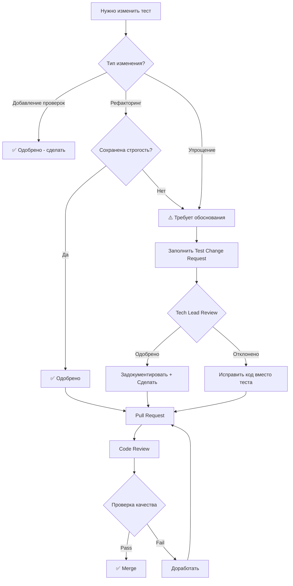

# Методология Обеспечения Качества Тестов
# Test Quality Assurance Methodology

**Дата создания:** 2026-01-21
**Версия:** 1.0
**Статус:** ✅ УТВЕРЖДЕНО

---

## 📖 Оглавление

1. [Введение](#введение)
2. [Принципы качественных тестов](#принципы-качественных-тестов)
3. [Методология сверки](#методология-сверки)
4. [Процесс изменения тестов](#процесс-изменения-тестов)
5. [Автоматизация контроля](#автоматизация-контроля)
6. [Инструменты и скрипты](#инструменты-и-скрипты)
7. [Примеры](#примеры)

---

## 🎯 Введение

### Цель документа

Этот документ определяет **методологию обеспечения качества тестов** для проекта Daten20. Он создан в ответ на обнаруженные случаи упрощения тестов и призван предотвратить подобные проблемы в будущем.

### Основная проблема

**Антипаттерн:** При наличии failing тестов разработчик **ослабляет тест** вместо **исправления кода**.

```python
# ❌ НЕПРАВИЛЬНО: Ослабили тест
# Было: with pytest.raises(ValueError)
# Стало: result = func(); assert result is not None

# ✅ ПРАВИЛЬНО: Исправили код
# Код должен выбрасывать ValueError при некорректных данных
```

### Философия

> **"Тесты - это защита качества кода. Ослабление тестов = снижение качества продукта."**

Тесты должны **эволюционировать от простых к сложным**, добавляя проверки, а не убирая их.

---

## 🏛️ Принципы Качественных Тестов

### 1. Принцип Возрастающей Строгости

**Тесты должны становиться строже со временем, а не мягче.**

```python
# Эволюция теста (правильно)
# v1.0 - базовая проверка
def test_calculation():
    result = calculate(10, 5)
    assert result is not None

# v2.0 - добавили проверку типа
def test_calculation():
    result = calculate(10, 5)
    assert isinstance(result, float)
    assert result is not None

# v3.0 - добавили проверку точности
def test_calculation():
    result = calculate(10, 5)
    assert isinstance(result, float)
    assert abs(result - 15.0) < 0.001  # Строгая проверка
```

### 2. Принцип Явных Ошибок

**Ошибочные ситуации должны выбрасывать исключения, а не возвращать "дефолтные" значения.**

```python
# ✅ ПРАВИЛЬНО
def predict(self, text):
    if not self.is_trained:
        raise ValueError("Model must be trained before prediction")
    return self._predict_internal(text)

def test_predict_untrained():
    classifier = Classifier()
    with pytest.raises(ValueError, match="must be trained"):
        classifier.predict("test")

# ❌ НЕПРАВИЛЬНО
def predict(self, text):
    if not self.is_trained:
        return ClassificationResult(category="UNKNOWN", confidence=0.0)
    return self._predict_internal(text)
```

### 3. Принцип Обоснованного Tolerance

**Tolerance в assertions должен быть технически обоснован.**

```python
# Обоснование tolerance
# ✅ ПРАВИЛЬНО: tolerance = 0.001 (0.1%)
# Причина: Точность float в Python ~15 знаков, 0.1% допустимо для математических операций

assert abs(result - expected) < 0.001  # Обосновано

# ❌ НЕПРАВИЛЬНО: tolerance = 0.5 (50%)
# Причина: "Чтобы тест прошел" - не является техническим обоснованием
assert abs(result - expected) < 0.5  # Не обосновано
```

### 4. Принцип Полного Покрытия Edge Cases

**Тесты должны покрывать граничные случаи, а не только happy path.**

```python
class TestDocumentClassifier:
    def test_happy_path(self):
        """Нормальный случай"""
        result = classifier.predict("invoice document")
        assert result.category == "INVOICE"

    def test_empty_input(self):
        """Edge case: пустой ввод"""
        with pytest.raises(ValueError):
            classifier.predict("")

    def test_very_long_input(self):
        """Edge case: очень длинный текст"""
        long_text = "word " * 10000
        result = classifier.predict(long_text)
        assert result.category in DocumentCategory

    def test_special_characters(self):
        """Edge case: специальные символы"""
        result = classifier.predict("!@#$%^&*()")
        assert isinstance(result, ClassificationResult)

    def test_unicode_input(self):
        """Edge case: Unicode"""
        result = classifier.predict("Документ по-русски 中文")
        assert result.category in DocumentCategory
```

### 5. Принцип Независимости Тестов

**Каждый тест должен быть самодостаточным и не зависеть от других тестов.**

```python
# ✅ ПРАВИЛЬНО: Каждый тест независим
class TestDatabase:
    @pytest.fixture
    def db(self):
        """Создаем fresh database для каждого теста"""
        db = Database(":memory:")
        db.init_schema()
        return db

    def test_insert(self, db):
        db.insert("users", {"name": "Alice"})
        assert db.count("users") == 1

    def test_delete(self, db):
        db.insert("users", {"name": "Alice"})
        db.delete("users", {"name": "Alice"})
        assert db.count("users") == 0

# ❌ НЕПРАВИЛЬНО: Тесты зависят друг от друга
class TestDatabase:
    db = Database(":memory:")  # Shared state!

    def test_insert(self):
        self.db.insert("users", {"name": "Alice"})
        # Тест 2 зависит от выполнения теста 1

    def test_delete(self):
        self.db.delete("users", {"name": "Alice"})
        # Упадет, если test_insert не выполнился
```

---

## 🔬 Методология Сверки

### Процесс Сверки Изменений Тестов

#### Этап 1: Идентификация Изменений

**Команды для поиска изменений:**

```bash
#!/bin/bash
# Скрипт: identify_test_changes.sh

# 1. Найти все измененные тестовые файлы
git diff --name-only HEAD~N HEAD | grep "^tests/.*\.py$"

# 2. Найти изменения в assertions
git diff HEAD~N HEAD -- tests/ | grep -E "^\-.*assert|^\+.*assert"

# 3. Найти изменения в exception handling
git diff HEAD~N HEAD -- tests/ | grep -E "^\-.*raises|^\+.*raises"

# 4. Найти изменения в численных значениях (tolerance, thresholds)
git diff HEAD~N HEAD -- tests/ | grep -E "^\-.*[0-9]\.[0-9]|^\+.*[0-9]\.[0-9]"
```

#### Этап 2: Классификация Изменений

**Таблица классификации:**

| Категория | Индикаторы | Риск | Требует Review |
|-----------|-----------|------|---------------|
| 🟢 **Улучшение** | + assertions, + raises, tolerance ↓ | Низкий | 1 reviewer |
| 🟡 **Нейтральное** | Рефакторинг без изменения логики | Средний | 1 reviewer |
| 🟠 **Подозрительное** | tolerance ↑ < 50%, counts ↓ | Высокий | 2 reviewers |
| 🔴 **Упрощение** | - raises, tolerance ↑ > 50%, - assertions | Критический | 2 reviewers + lead |

#### Этап 3: Детальный Анализ

**Для каждого изменения категории 🟠 или 🔴:**

```markdown
## Анализ Изменения Теста

**Файл:** tests/unit/ml/test_classifier.py
**Функция:** test_confidence_calculation
**Категория:** 🔴 Упрощение

### Изменения:
- **Было:** `assert abs(result - expected) < 0.01`
- **Стало:** `assert abs(result - expected) < 0.5`
- **Изменение:** tolerance увеличен с 1% до 50% (50x!)

### Причина изменения:
[Указать причину из коммита или спросить у автора]

### Техническое обоснование:
[ ] Есть техническое обоснование
[ ] Нет технического обоснования
[ ] Требуется исследование

### Решение:
- [ ] Одобрить изменение (с обоснованием)
- [x] Отклонить - восстановить оригинальный тест
- [ ] Отклонить - исправить код для прохождения строгого теста

### Action Items:
1. Восстановить tolerance = 0.01
2. Исправить баг в calculate() функции
3. Добавить unit test для математической точности
```

#### Этап 4: Матрица Сравнения

**Создать таблицу сравнения всех изменений:**

| Test File | Test Name | Метрика | Было | Стало | ΔΔ% | Статус | Action |
|-----------|-----------|---------|------|-------|-----|--------|--------|
| test_classifier.py | test_confidence | tolerance | 0.01 | 0.5 | +4900% | 🔴 | Восстановить |
| test_classifier.py | test_multiclass | min categories | 2 | 1 | -50% | 🔴 | Восстановить |
| test_classifier.py | test_untrained | exception | raises | pass | N/A | 🔴 | Восстановить |
| test_parser.py | test_parse_pdf | assertions | 5 | 7 | +40% | 🟢 | Одобрено |

---

## 🔄 Процесс Изменения Тестов

### Workflow для Изменения Существующих Тестов



### Test Change Request Template

**Файл:** `.github/TEST_CHANGE_REQUEST.md`

```markdown
# Test Change Request

## Общая Информация
- **Дата:** YYYY-MM-DD
- **Автор:** @username
- **Связанный Issue/PR:** #XXX

## Детали Изменения

### Затронутые Тесты
- **Файл:** tests/unit/module/test_file.py
- **Функция:** test_function_name
- **Строки:** 123-145

### Тип Изменения
- [ ] Улучшение (добавление проверок)
- [ ] Рефакторинг (без изменения логики)
- [ ] Исправление бага в тесте
- [x] Упрощение / Смягчение проверок ⚠️

### Код Изменений

**До:**
```python
def test_example():
    with pytest.raises(ValueError):
        function_call()
```

**После:**
```python
def test_example():
    result = function_call()
    assert result is not None
```

### Обоснование

**Почему это изменение необходимо?**
[Подробное техническое обоснование]

**Почему нельзя исправить код вместо теста?**
[Объяснение, почему код правильный, а тест был неверным]

**Какие риски несет это изменение?**
[Анализ потенциальных рисков]

### Альтернативы

**Рассмотренные альтернативы:**
1. [Альтернатива 1: Исправить код]
2. [Альтернатива 2: Улучшить данные для теста]
3. [Альтернатива 3: ...]

**Почему выбрано текущее решение:**
[Обоснование выбора]

### Impact Analysis

**Влияние на покрытие:**
- Текущее покрытие: XX%
- После изменения: YY%
- Δ: ±Z%

**Влияние на качество:**
- [ ] Качество не снизится
- [ ] Качество может снизиться, но приемлемо
- [ ] Требуется компенсация другими тестами

### Компенсационные Меры

**Если упрощение одобрено, как компенсировать:**
- [ ] Добавить интеграционный тест
- [ ] Добавить E2E тест
- [ ] Добавить мониторинг в production
- [ ] Другое: [указать]

### Approvals

- [ ] Self-review completed
- [ ] 1st Reviewer: @reviewer1 - ✅/❌
- [ ] 2nd Reviewer: @reviewer2 - ✅/❌ (для упрощений)
- [ ] Tech Lead: @techlead - ✅/❌ (для упрощений)

### Checklist

- [ ] Техническое обоснование предоставлено
- [ ] Рассмотрены альтернативы
- [ ] Impact analysis выполнен
- [ ] Компенсационные меры определены (если нужно)
- [ ] Документация обновлена
- [ ] Все reviewers одобрили

---

**Статус:** ⏳ Ожидает Review
**Last Updated:** YYYY-MM-DD
```

---

## 🤖 Автоматизация Контроля

### Pre-Commit Hook

**Файл:** `.git/hooks/pre-commit`

```bash
#!/bin/bash
# Pre-commit hook для проверки качества тестов

echo "🔍 Checking test changes..."

# Получить список измененных тестовых файлов
MODIFIED_TESTS=$(git diff --cached --name-only | grep "^tests/.*\.py$")

if [ -z "$MODIFIED_TESTS" ]; then
  echo "✅ No test files modified"
  exit 0
fi

WARNINGS=0
ERRORS=0

for TEST_FILE in $MODIFIED_TESTS; do
  echo "Checking $TEST_FILE..."

  # Проверка 1: Удаление pytest.raises
  REMOVED_RAISES=$(git diff --cached $TEST_FILE | grep "^-.*pytest\.raises" | wc -l)
  ADDED_RAISES=$(git diff --cached $TEST_FILE | grep "^+.*pytest\.raises" | wc -l)

  if [ $REMOVED_RAISES -gt $ADDED_RAISES ]; then
    echo "⚠️  WARNING: Removed pytest.raises in $TEST_FILE"
    echo "   Removed: $REMOVED_RAISES, Added: $ADDED_RAISES"
    echo "   This may be a test simplification!"
    WARNINGS=$((WARNINGS + 1))
  fi

  # Проверка 2: Изменение assert operations
  CHANGED_ASSERTS=$(git diff --cached $TEST_FILE | grep -E "^\-.*assert.*[<>]=?" | wc -l)

  if [ $CHANGED_ASSERTS -gt 0 ]; then
    echo "⚠️  WARNING: Changed comparison assertions in $TEST_FILE"
    echo "   Changed lines: $CHANGED_ASSERTS"
    WARNINGS=$((WARNINGS + 1))
  fi

  # Проверка 3: Увеличение численных значений в assert
  # (упрощенная проверка - ищем изменения с числами)
  NUMERIC_CHANGES=$(git diff --cached $TEST_FILE | grep -E "^\-.*assert.*[0-9]\.[0-9]" | wc -l)

  if [ $NUMERIC_CHANGES -gt 0 ]; then
    echo "⚠️  WARNING: Changed numeric assertions in $TEST_FILE"
    echo "   This may indicate tolerance/threshold changes"
    WARNINGS=$((WARNINGS + 1))
  fi
done

# Вывод результатов
echo ""
echo "=========================================="
if [ $ERRORS -gt 0 ]; then
  echo "❌ $ERRORS ERROR(S) found - commit blocked"
  echo "Please fix the issues and try again"
  exit 1
elif [ $WARNINGS -gt 0 ]; then
  echo "⚠️  $WARNINGS WARNING(S) found"
  echo ""
  echo "Test changes detected that may be simplifications."
  echo "Please ensure:"
  echo "  1. Changes are technically justified"
  echo "  2. Test Change Request is filled (for simplifications)"
  echo "  3. Appropriate reviewers are assigned"
  echo ""
  echo "Proceed with commit? (y/n)"
  read -r RESPONSE
  if [ "$RESPONSE" != "y" ]; then
    echo "Commit cancelled"
    exit 1
  fi
else
  echo "✅ All checks passed"
fi

exit 0
```

### GitHub Actions - Test Quality Check

**Файл:** `.github/workflows/test-quality-check.yml`

```yaml
name: Test Quality Check

on:
  pull_request:
    paths:
      - 'tests/**/*.py'

jobs:
  check-test-quality:
    runs-on: ubuntu-latest
    steps:
      - uses: actions/checkout@v3
        with:
          fetch-depth: 0  # Полная история для сравнения

      - name: Set up Python
        uses: actions/setup-python@v4
        with:
          python-version: '3.11'

      - name: Install dependencies
        run: |
          pip install pytest
          pip install -r requirements.txt

      - name: Analyze test changes
        run: |
          python scripts/analyze_test_changes.py \
            --base ${{ github.base_ref }} \
            --head ${{ github.head_ref }} \
            --output test-changes-report.md

      - name: Check for test simplifications
        run: |
          python scripts/detect_test_simplifications.py \
            --base ${{ github.base_ref }} \
            --head ${{ github.head_ref }} \
            --strict

      - name: Comment PR with analysis
        uses: actions/github-script@v6
        with:
          script: |
            const fs = require('fs');
            const report = fs.readFileSync('test-changes-report.md', 'utf8');
            github.rest.issues.createComment({
              issue_number: context.issue.number,
              owner: context.repo.owner,
              repo: context.repo.repo,
              body: report
            });

      - name: Upload report
        uses: actions/upload-artifact@v3
        with:
          name: test-quality-report
          path: test-changes-report.md
```

---

## 🛠️ Инструменты и Скрипты

### Скрипт 1: Автоматический Аудит Тестов

**Файл:** `scripts/audit_test_simplifications.sh`

```bash
#!/bin/bash
# Автоматический аудит упрощений тестов

echo "🔍 Test Simplification Audit"
echo "================================"

# Параметры
COMMIT_RANGE="${1:-HEAD~20..HEAD}"
OUTPUT_FILE="test_simplification_audit_$(date +%Y%m%d_%H%M%S).md"

echo "Analyzing commits: $COMMIT_RANGE"
echo "Output file: $OUTPUT_FILE"
echo ""

# Создать отчет
cat > "$OUTPUT_FILE" << EOF
# Test Simplification Audit Report
**Date:** $(date +"%Y-%m-%d %H:%M:%S")
**Commit Range:** $COMMIT_RANGE
**Generated by:** $(whoami)

---

## Summary

EOF

# Счетчики
TOTAL_TEST_FILES_CHANGED=0
SUSPICIOUS_CHANGES=0

# Найти все измененные тестовые файлы
CHANGED_TEST_FILES=$(git diff --name-only $COMMIT_RANGE | grep "^tests/.*\.py$")

if [ -z "$CHANGED_TEST_FILES" ]; then
  echo "✅ No test files changed in this range"
  echo "No test files changed." >> "$OUTPUT_FILE"
  exit 0
fi

TOTAL_TEST_FILES_CHANGED=$(echo "$CHANGED_TEST_FILES" | wc -l)

echo "### Changed Test Files: $TOTAL_TEST_FILES_CHANGED" >> "$OUTPUT_FILE"
echo "" >> "$OUTPUT_FILE"

# Анализировать каждый файл
for TEST_FILE in $CHANGED_TEST_FILES; do
  echo "Analyzing $TEST_FILE..."

  echo "#### $TEST_FILE" >> "$OUTPUT_FILE"
  echo "" >> "$OUTPUT_FILE"

  # Проверка 1: pytest.raises удален
  REMOVED_RAISES=$(git diff $COMMIT_RANGE -- "$TEST_FILE" | grep "^-.*pytest\.raises" | wc -l)
  ADDED_RAISES=$(git diff $COMMIT_RANGE -- "$TEST_FILE" | grep "^+.*pytest\.raises" | wc -l)

  if [ $REMOVED_RAISES -gt $ADDED_RAISES ]; then
    echo "🔴 **SUSPICIOUS:** Removed pytest.raises" >> "$OUTPUT_FILE"
    echo "- Removed: $REMOVED_RAISES" >> "$OUTPUT_FILE"
    echo "- Added: $ADDED_RAISES" >> "$OUTPUT_FILE"
    echo "" >> "$OUTPUT_FILE"
    SUSPICIOUS_CHANGES=$((SUSPICIOUS_CHANGES + 1))
  fi

  # Проверка 2: Изменения в assert statements
  CHANGED_ASSERTS=$(git diff $COMMIT_RANGE -- "$TEST_FILE" | grep -c "^-.*assert")

  if [ $CHANGED_ASSERTS -gt 0 ]; then
    echo "⚠️  **INFO:** Changed assertions: $CHANGED_ASSERTS" >> "$OUTPUT_FILE"
    echo "" >> "$OUTPUT_FILE"

    # Показать примеры
    echo "**Examples:**" >> "$OUTPUT_FILE"
    echo '```diff' >> "$OUTPUT_FILE"
    git diff $COMMIT_RANGE -- "$TEST_FILE" | grep -A 1 "^-.*assert" | head -10 >> "$OUTPUT_FILE"
    echo '```' >> "$OUTPUT_FILE"
    echo "" >> "$OUTPUT_FILE"
  fi

  # Проверка 3: Численные изменения
  git diff $COMMIT_RANGE -- "$TEST_FILE" | grep -E "^[\-\+].*assert.*[<>]=?.*[0-9]" > /tmp/numeric_changes_$$

  if [ -s /tmp/numeric_changes_$$ ]; then
    echo "⚠️  **INFO:** Numeric assertion changes detected" >> "$OUTPUT_FILE"
    echo '```diff' >> "$OUTPUT_FILE"
    cat /tmp/numeric_changes_$$ | head -10 >> "$OUTPUT_FILE"
    echo '```' >> "$OUTPUT_FILE"
    echo "" >> "$OUTPUT_FILE"
  fi

  rm -f /tmp/numeric_changes_$$
  echo "---" >> "$OUTPUT_FILE"
  echo "" >> "$OUTPUT_FILE"
done

# Добавить итоги
cat >> "$OUTPUT_FILE" << EOF

## Statistics

- **Total test files changed:** $TOTAL_TEST_FILES_CHANGED
- **Suspicious changes found:** $SUSPICIOUS_CHANGES

## Recommendation

EOF

if [ $SUSPICIOUS_CHANGES -eq 0 ]; then
  echo "✅ **No suspicious test simplifications detected.**" >> "$OUTPUT_FILE"
  echo ""
  echo "✅ Audit complete: No issues found"
else
  echo "⚠️  **Found $SUSPICIOUS_CHANGES suspicious change(s).**" >> "$OUTPUT_FILE"
  echo "" >> "$OUTPUT_FILE"
  echo "Please review manually and ensure changes are justified." >> "$OUTPUT_FILE"
  echo ""
  echo "⚠️  Audit complete: $SUSPICIOUS_CHANGES issue(s) found"
fi

echo ""
echo "Report saved to: $OUTPUT_FILE"
echo ""
echo "To view: cat $OUTPUT_FILE"
```

**Использование:**
```bash
# Проверить последние 20 коммитов (по умолчанию)
./scripts/audit_test_simplifications.sh

# Проверить конкретный диапазон
./scripts/audit_test_simplifications.sh HEAD~50..HEAD

# Проверить между двумя коммитами
./scripts/audit_test_simplifications.sh abc123..def456
```

---

### Скрипт 2: Сравнение Тестовых Метрик

**Файл:** `scripts/compare_test_metrics.py`

```python
#!/usr/bin/env python3
"""
Сравнивает метрики тестов между двумя коммитами
"""

import subprocess
import re
import sys
from collections import defaultdict
from typing import Dict, List, Tuple

def get_test_metrics(commit: str, test_file: str) -> Dict[str, any]:
    """Извлечь метрики из тестового файла в конкретном коммите"""
    try:
        content = subprocess.check_output(
            ['git', 'show', f'{commit}:{test_file}'],
            stderr=subprocess.DEVNULL
        ).decode('utf-8')
    except:
        return {}

    metrics = {
        'pytest_raises_count': len(re.findall(r'pytest\.raises', content)),
        'assert_count': len(re.findall(r'^\s*assert ', content, re.MULTILINE)),
        'test_functions': len(re.findall(r'^def test_\w+', content, re.MULTILINE)),
        'tolerances': [],
        'comparisons': {
            '==': len(re.findall(r'assert.*==', content)),
            '!=': len(re.findall(r'assert.*!=', content)),
            '<': len(re.findall(r'assert.*<[^=]', content)),
            '>': len(re.findall(r'assert.*>[^=]', content)),
            '<=': len(re.findall(r'assert.*<=', content)),
            '>=': len(re.findall(r'assert.*>=', content)),
        }
    }

    # Найти tolerance values
    tolerance_pattern = r'<\s*(0\.\d+)'
    metrics['tolerances'] = [
        float(m) for m in re.findall(tolerance_pattern, content)
    ]

    return metrics

def compare_metrics(old: Dict, new: Dict) -> Dict[str, any]:
    """Сравнить две метрики"""
    comparison = {}

    for key in old.keys():
        if key == 'tolerances':
            if old[key] and new[key]:
                avg_old = sum(old[key]) / len(old[key])
                avg_new = sum(new[key]) / len(new[key])
                comparison[key] = {
                    'old': avg_old,
                    'new': avg_new,
                    'change': avg_new - avg_old,
                    'percent': ((avg_new / avg_old) - 1) * 100 if avg_old > 0 else 0
                }
        elif key == 'comparisons':
            comparison[key] = {}
            for op in old[key]:
                old_val = old[key][op]
                new_val = new[key][op]
                comparison[key][op] = {
                    'old': old_val,
                    'new': new_val,
                    'change': new_val - old_val
                }
        else:
            comparison[key] = {
                'old': old[key],
                'new': new[key],
                'change': new[key] - old[key]
            }

    return comparison

def main():
    if len(sys.argv) < 3:
        print("Usage: compare_test_metrics.py <old_commit> <new_commit> [test_file]")
        sys.exit(1)

    old_commit = sys.argv[1]
    new_commit = sys.argv[2]

    # Получить список тестовых файлов
    if len(sys.argv) > 3:
        test_files = [sys.argv[3]]
    else:
        result = subprocess.run(
            ['git', 'diff', '--name-only', old_commit, new_commit],
            capture_output=True, text=True
        )
        test_files = [
            f for f in result.stdout.split('\n')
            if f.startswith('tests/') and f.endswith('.py')
        ]

    print(f"# Test Metrics Comparison")
    print(f"**Old:** {old_commit}")
    print(f"**New:** {new_commit}")
    print()

    suspicious_files = []

    for test_file in test_files:
        if not test_file:
            continue

        print(f"## {test_file}")
        print()

        old_metrics = get_test_metrics(old_commit, test_file)
        new_metrics = get_test_metrics(new_commit, test_file)

        if not old_metrics or not new_metrics:
            print("⚠️  File not found in one of the commits")
            print()
            continue

        comparison = compare_metrics(old_metrics, new_metrics)

        # Вывод метрик
        print("| Metric | Old | New | Change |")
        print("|--------|-----|-----|--------|")

        is_suspicious = False

        for metric, data in comparison.items():
            if metric == 'tolerances':
                if 'old' in data:
                    change_str = f"{data['change']:+.4f} ({data['percent']:+.1f}%)"
                    status = "🔴" if data['percent'] > 50 else ("🟡" if data['percent'] > 10 else "")
                    if data['percent'] > 50:
                        is_suspicious = True
                    print(f"| Avg Tolerance {status} | {data['old']:.4f} | {data['new']:.4f} | {change_str} |")
            elif metric == 'comparisons':
                continue  # Пропускаем подробности comparison operators
            else:
                change_str = f"{data['change']:+d}"
                status = ""

                # Проверка подозрительных изменений
                if metric == 'pytest_raises_count' and data['change'] < 0:
                    status = "🔴"
                    is_suspicious = True
                elif metric == 'assert_count' and data['change'] < -5:
                    status = "🟡"
                    is_suspicious = True

                metric_name = metric.replace('_', ' ').title()
                print(f"| {metric_name} {status} | {data['old']} | {data['new']} | {change_str} |")

        if is_suspicious:
            suspicious_files.append(test_file)
            print()
            print("⚠️  **SUSPICIOUS CHANGES DETECTED**")

        print()
        print("---")
        print()

    # Итоги
    if suspicious_files:
        print(f"## ⚠️  Suspicious Files ({len(suspicious_files)})")
        print()
        for f in suspicious_files:
            print(f"- {f}")
    else:
        print("## ✅ No Suspicious Changes")

if __name__ == '__main__':
    main()
```

**Использование:**
```bash
# Сравнить метрики между коммитами
python scripts/compare_test_metrics.py HEAD~10 HEAD

# Сравнить конкретный файл
python scripts/compare_test_metrics.py abc123 def456 tests/unit/ml/test_classifier.py
```

---

## 📚 Примеры

### Пример 1: Правильное Улучшение Теста

```python
# Commit 1: Базовый тест
def test_parse_document():
    result = parse_document("test.pdf")
    assert result is not None

# Commit 2: Добавили проверку структуры ✅
def test_parse_document():
    result = parse_document("test.pdf")
    assert result is not None
    assert 'content' in result
    assert 'metadata' in result

# Commit 3: Добавили проверку типов ✅
def test_parse_document():
    result = parse_document("test.pdf")
    assert isinstance(result, Document)
    assert isinstance(result.content, str)
    assert isinstance(result.metadata, dict)
    assert len(result.content) > 0

# ✅ ПРАВИЛЬНО: Тест становится строже с каждым коммитом
```

### Пример 2: Неправильное Упрощение (Избегать!)

```python
# Commit 1: Строгий тест
def test_parse_invalid_document():
    with pytest.raises(ValueError, match="Invalid document format"):
        parse_document("invalid.xyz")

# Commit 2: Ослабили тест ❌
def test_parse_invalid_document():
    result = parse_document("invalid.xyz")
    # Теперь просто возвращаем None вместо exception
    assert result is None

# ❌ НЕПРАВИЛЬНО: Тест стал мягче, потеряна проверка exception
```

### Пример 3: Правильная Обработка Ложно-Положительного Теста

```python
# Исходный тест (ложно-положительный)
def test_calculate_average():
    # Тест был неправильным - ожидал wrong value
    result = calculate_average([1, 2, 3])
    assert result == 2.5  # ❌ Неправильно: среднее = 2.0

# Исправление ✅
def test_calculate_average():
    """
    FIX: Corrected expected value
    Previous test expected 2.5, but correct average of [1,2,3] is 2.0
    Test was failing correctly - indicating a misunderstanding in test.
    """
    result = calculate_average([1, 2, 3])
    assert result == 2.0  # ✅ Правильно

    # Добавили больше test cases для уверенности ✅
    assert calculate_average([0, 0, 0]) == 0.0
    assert calculate_average([5]) == 5.0
    assert abs(calculate_average([1, 2]) - 1.5) < 0.001
```

---

## ✅ Checklist для Code Review

### При Review PR с Изменениями Тестов

**Обязательно проверить:**

- [ ] **Документация изменений**
  - [ ] Причина изменения указана в PR description
  - [ ] Для упрощений заполнен Test Change Request

- [ ] **Анализ изменений**
  - [ ] Изменения не ослабляют существующие проверки
  - [ ] pytest.raises не удален без обоснования
  - [ ] Tolerance не увеличен значительно (> 10%)
  - [ ] Assertions не удалены

- [ ] **Качество тестов**
  - [ ] Новые тесты покрывают edge cases
  - [ ] Тесты независимы друг от друга
  - [ ] Используются подходящие fixtures
  - [ ] Четкие docstrings

- [ ] **Test Size markers**
  - [ ] Все тесты помечены (small/medium/large)
  - [ ] Размер соответствует характеристикам теста

- [ ] **Компенсация (если есть упрощения)**
  - [ ] Добавлены компенсационные тесты
  - [ ] Или добавлен мониторинг в production
  - [ ] Риски задокументированы

### Критерии Отклонения PR

**Автоматически отклонить PR если:**

- ❌ Удалены pytest.raises без технического обоснования
- ❌ Tolerance увеличен > 50% без одобрения tech lead
- ❌ Удалено > 10% assertions без обоснования
- ❌ Нет Test Change Request для упрощений
- ❌ Упрощение не одобрено необходимым количеством reviewers

---

## 📖 Заключение

Эта методология обеспечивает:

✅ **Защиту от деградации качества** тестов
✅ **Прозрачность** изменений в тестах
✅ **Автоматический контроль** через hooks и CI/CD
✅ **Документирование** всех значимых изменений
✅ **Continuous improvement** качества тестового покрытия

### Ключевые Принципы

1. **Тесты должны становиться строже, а не мягче**
2. **Ошибочные ситуации должны выбрасывать exceptions**
3. **Tolerance должен быть технически обоснован**
4. **Edge cases должны быть покрыты**
5. **Любое упрощение требует обоснования и одобрения**

---

**Версия:** 1.0
**Дата:** 2026-01-21
**Статус:** ✅ Утверждено для использования
**Владелец документа:** Tech Lead / QA Lead
