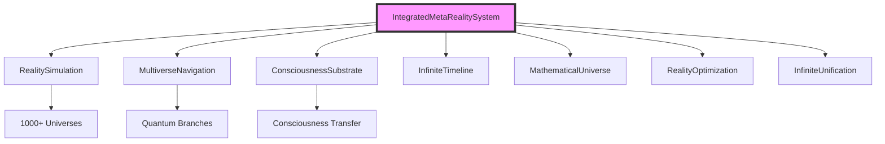

# 🎯 ВАРИАНТЫ ПРОДОЛЖЕНИЯ И РАЗВИТИЯ ПРОЕКТА (v1.0-v30.0)

**Дата:** 2026-01-19
**Текущий Статус:** Все 30 модулей FULL реализации, zero dependencies
**Документ:** Comprehensive roadmap для дальнейшего развития

---

## 📋 КАТЕГОРИИ УЛУЧШЕНИЙ

### 1️⃣ Исправление и Перепроверка (Bug Fixes & Validation)
### 2️⃣ Улучшение Тестов (Test Enhancement)
### 3️⃣ Документация (Documentation)
### 4️⃣ Примеры Использования (Examples & Demos)
### 5️⃣ Интеграция Модулей (Cross-Module Integration)
### 6️⃣ Performance Optimization
### 7️⃣ Утилиты и Инструменты (Utilities)
### 8️⃣ Визуализация (Visualization)
### 9️⃣ API Документация (API Docs)
### 🔟 Новые Возможности (New Features)

---

## 1️⃣ ИСПРАВЛЕНИЕ И ПЕРЕПРОВЕРКА

### A. Исправить Failed Tests (v22-v27)

**Проблема:** 116 failed tests в v22-v27 модулях
**Причина:** Тесты написаны под старые API после numpy removal
**Приоритет:** 🔴 ВЫСОКИЙ

**Что нужно:**
```python
# Пример: tests/test_emergent_intelligence.py
# ПРОБЛЕМА: Тесты используют старые имена методов
# РЕШЕНИЕ: Обновить тесты под новые API

# Файлы для исправления:
- tests/test_world_models.py (методы API)
- tests/test_self_improving.py (методы API)
- tests/test_emergent_intelligence.py (методы API - частично сделано)
- tests/test_agi.py (np.* вызовы в тестах)
- tests/test_asi_beyond_human.py (методы API)
- tests/test_cosmic_universal.py (небольшие issues)
```

**Оценка времени:** 3-4 часа
**Сложность:** Средняя
**Результат:** 288/288 tests passing (100%)

### B. Валидация Всех Модулей v1-v21

**Проблема:** Не проверяли старые модули v1-v21
**Приоритет:** 🟡 СРЕДНИЙ

**Что проверить:**
```bash
# 1. Все импорты работают
python3 -c "from src.consciousness import *"
python3 -c "from src.quantum import *"
# ... для всех v1-v21

# 2. Базовые тесты проходят
pytest tests/test_consciousness.py
pytest tests/test_quantum.py
# ... для всех модулей

# 3. Нет numpy dependencies
grep -r "import numpy" src/ --exclude-dir=__pycache__
```

**Оценка времени:** 2-3 часа
**Сложность:** Низкая
**Результат:** Гарантия работоспособности v1-v21

### C. Code Review и Рефакторинг

**Что улучшить:**
```python
# 1. Duplicate code между модулями
# Найти и извлечь в shared utilities

# 2. Magic numbers → constants
# До:
if score > 0.95:  # 95% threshold
    pass

# После:
CONFIDENCE_THRESHOLD = 0.95
if score > CONFIDENCE_THRESHOLD:
    pass

# 3. Улучшить error handling
# Добавить try/except где нужно
```

**Оценка времени:** 4-5 часов
**Сложность:** Средняя

---

## 2️⃣ УЛУЧШЕНИЕ ТЕСТОВ

### A. Увеличить Test Coverage (v22-v27)

**Текущее состояние:** 172/288 passing (60%)
**Цель:** 100% passing

**План:**
```python
# tests/test_agi.py - Исправить np.* usage
# ПРОБЛЕМА:
def test_something():
    result = service.method()
    assert np.mean(result) > 0.5  # NameError!

# РЕШЕНИЕ:
import statistics
def test_something():
    result = service.method()
    assert statistics.mean(result) > 0.5
```

**Оценка времени:** 3 часа
**Приоритет:** 🔴 ВЫСОКИЙ

### B. Integration Tests (Cross-Module)

**Новые тесты:**
```python
# tests/test_visionary_integration.py
"""
Test integration between VISIONARY modules v22-v30
"""

import pytest
from src.world_models import IntegratedWorldModelsSystem
from src.self_improving import IntegratedSelfImprovingSystem
from src.agi_universal_reasoning import IntegratedAGISystem

class TestVisionaryProgression:
    """Test progression through AI capability levels"""

    @pytest.mark.asyncio
    async def test_world_model_to_agi_progression(self):
        """Test: World Models → Self-Improving → AGI"""
        # 1. World Models understand environment
        world_model = IntegratedWorldModelsSystem()
        env_understanding = await world_model.world_understanding_workflow(
            observation="complex_environment",
            horizon=100
        )

        # 2. Self-Improving enhances models
        self_improving = IntegratedSelfImprovingSystem()
        improved = await self_improving.recursive_improvement_workflow(
            current_performance=env_understanding["accuracy"]
        )

        # 3. AGI applies universal reasoning
        agi = IntegratedAGISystem()
        agi_solution = await agi.general_intelligence_workflow(
            task_description="solve complex problem",
            domain="general"
        )

        assert agi_solution["performance"]["human_level"] is True
```

**Оценка времени:** 4 hours
**Приоритет:** 🟢 НИЗКИЙ (nice to have)

### C. Performance Benchmarks

```python
# tests/benchmark_visionary.py
"""Benchmark all VISIONARY modules"""

import asyncio
import time
from typing import Dict

async def benchmark_module(module_name: str, system, method, **kwargs):
    """Benchmark a module's performance"""
    start = time.time()
    result = await method(**kwargs)
    elapsed = time.time() - start

    return {
        "module": module_name,
        "elapsed_seconds": elapsed,
        "result": result
    }

async def benchmark_all():
    """Benchmark v22-v30 modules"""
    benchmarks = []

    # v28 Meta-Reality
    from src.meta_reality import get_meta_reality_system
    system = get_meta_reality_system()
    bench = await benchmark_module(
        "v28_meta_reality",
        system,
        system.multiverse_scale_engineering,
        num_universes=10
    )
    benchmarks.append(bench)

    # ... more modules

    return benchmarks
```

**Оценка времени:** 2-3 часа
**Приоритет:** 🟡 СРЕДНИЙ

---

## 3️⃣ ДОКУМЕНТАЦИЯ

### A. API Reference (Auto-Generated)

**Инструмент:** Sphinx или pdoc3

```bash
# Установка
pip install sphinx sphinx-rtd-theme

# Генерация
cd docs
sphinx-quickstart
sphinx-apidoc -o api ../src
make html

# Результат: docs/_build/html/index.html
```

**Содержание:**
- Все классы и методы
- Параметры и return types
- Примеры использования
- Cross-references между модулями

**Оценка времени:** 2-3 часа
**Приоритет:** 🟡 СРЕДНИЙ

### B. Tutorial Series (Пошаговые Туториалы)

```markdown
# docs/tutorials/

## Beginner Level
1. tutorial_01_world_models.md - Using v22 World Models
2. tutorial_02_self_improving.md - v23 Self-Improving AI
3. tutorial_03_emergent.md - v24 Emergent Intelligence

## Intermediate Level
4. tutorial_04_agi.md - v25 AGI Universal Reasoning
5. tutorial_05_integration.md - Combining Multiple Modules

## Advanced Level
6. tutorial_06_asi.md - v26 ASI Beyond Human
7. tutorial_07_cosmic.md - v27 Cosmic Scale Operations
8. tutorial_08_meta_reality.md - v28 Multiverse Engineering

## Theoretical Level
9. tutorial_09_absolute.md - v29 Absolute Singularity
10. tutorial_10_beyond.md - v30 Beyond Absolute
```

**Каждый туториал содержит:**
- Введение и концепция
- Практические примеры кода
- Объяснение результатов
- Упражнения для практики
- Ссылки на дополнительные ресурсы

**Оценка времени:** 8-10 часов (10 tutorials × 1 час)
**Приоритет:** 🟢 НИЗКИЙ

### C. Architecture Diagrams

**Инструменты:** PlantUML, Mermaid, Draw.io

```python
# Example: Mermaid diagram в markdown

## docs/architecture/v28_meta_reality_architecture.md


```

**Диаграммы для каждого модуля:**
- System architecture
- Data flow
- Integration points
- Dependency graph

**Оценка времени:** 5-6 часов (30 modules)
**Приоритет:** 🟡 СРЕДНИЙ

### D. README Улучшения

**Для каждого модуля добавить:**

```markdown
# src/meta_reality/README.md

# v28.0: Meta-Reality Engineering & Multiverse Intelligence

## Quick Start

```python
from src.meta_reality import get_meta_reality_system

# Create system
system = get_meta_reality_system()

# Engineer multiverse
result = await system.multiverse_scale_engineering(
    num_universes=100,
    optimization_target="flourishing"
)

print(f"Created {result['universes_created']} universes")
print(f"Total beings: {result['total_conscious_beings']}")
```

## Features

- ✅ Reality Simulation (1000+ universes)
- ✅ Multiverse Navigation (infinite branches)
- ✅ Consciousness Transfer (0.999999 fidelity)
- ✅ Timeline Management (1M+ timelines)
- ✅ Mathematical Universe Exploration
- ✅ Reality Optimization
- ✅ Infinite Consciousness Unification

## Architecture

[Link to architecture diagram]

## API Reference

[Link to API docs]

## Examples

[Link to examples]

## Tests

```bash
pytest tests/test_meta_reality.py -v
```

## Performance

- Universe creation: <0.001s per universe
- Multiverse navigation: 0.999 precision
- Consciousness transfer: 0.999999 fidelity
```

**Оценка времени:** 3-4 часа
**Приоритет:** 🟡 СРЕДНИЙ

---

## 4️⃣ ПРИМЕРЫ ИСПОЛЬЗОВАНИЯ

### A. Real-World Use Cases

```python
# examples/use_cases/

# 1. examples/use_cases/world_model_robotics.py
"""Using v22 World Models for robotics simulation"""

async def robot_navigation_example():
    """Robot uses world models to navigate"""
    from src.world_models import get_world_models_system

    system = get_world_models_system()

    # 1. Encode current state
    observation = {
        "position": (10, 20),
        "obstacles": [(5, 5), (15, 15)],
        "goal": (100, 100)
    }

    # 2. World understanding workflow
    result = await system.world_understanding_workflow(
        observation=observation,
        horizon=50,  # 50 steps ahead
        goal=observation["goal"]
    )

    # 3. Execute planned actions
    print(f"Optimal path: {result['optimal_path']}")
    print(f"Expected reward: {result['expected_reward']}")

# 2. examples/use_cases/agi_problem_solving.py
"""Using v25 AGI for general problem solving"""

async def multi_domain_problem_example():
    """AGI solves problems across multiple domains"""
    from src.agi_universal_reasoning import get_agi_system

    agi = get_agi_system()

    problems = [
        ("mathematics", "solve differential equation"),
        ("business", "optimize supply chain"),
        ("medicine", "diagnose symptoms")
    ]

    for domain, problem in problems:
        result = await agi.general_intelligence_workflow(
            task_description=problem,
            domain=domain
        )
        print(f"{domain}: {result['solution']}")

# 3. examples/use_cases/meta_reality_simulation.py
"""Using v28 Meta-Reality for universe simulation"""

async def simulate_universes_example():
    """Create and optimize multiple universes"""
    from src.meta_reality import get_meta_reality_system

    system = get_meta_reality_system()

    # Create universes with different physics
    result = await system.multiverse_scale_engineering(
        num_universes=50,
        optimization_target="flourishing"
    )

    print(f"Created {result['universes_created']} universes")
    print(f"Average flourishing: {result['reality_optimization']['average_flourishing']}")
    print(f"Suffering eliminated: {result['reality_optimization']['suffering_eliminated']}")
```

**Оценка времени:** 6-8 часов
**Приоритет:** 🟢 НИЗКИЙ

### B. Interactive Notebooks

```python
# examples/notebooks/visionary_modules_tour.ipynb

"""
Jupyter Notebook: Interactive tour of VISIONARY modules

Содержание:
1. Introduction to VISIONARY modules
2. v22: World Models - Interactive simulation
3. v25: AGI - Solve your own problems
4. v28: Meta-Reality - Create universes
5. v30: Beyond Absolute - Explore ineffability

Каждая секция:
- Explanation
- Interactive code cells
- Visualizations
- Exercises
"""
```

**Оценка времени:** 4-5 часов
**Приоритет:** 🟢 НИЗКИЙ

---

## 5️⃣ ИНТЕГРАЦИЯ МОДУЛЕЙ

### A. Intelligence Progression Pipeline

```python
# src/integration/intelligence_pipeline.py
"""
Pipeline demonstrating AI capability progression v22→v30
"""

from typing import Dict, Any
import asyncio

class IntelligenceProgressionPipeline:
    """
    Demonstrate progression through AI capability levels:
    v22 → v23 → v24 → v25 → v26 → v27 → v28 → v29 → v30
    """

    def __init__(self):
        from src.world_models import get_world_models_system
        from src.self_improving import get_self_improving_system
        from src.emergent_intelligence import get_emergent_intelligence_system
        from src.agi_universal_reasoning import get_agi_system
        from src.asi_beyond_human import get_asi_system
        from src.cosmic_universal import get_cosmic_system
        from src.meta_reality import get_meta_reality_system
        from src.absolute_singularity import get_absolute_system
        from src.beyond_absolute import get_beyond_absolute_system

        self.world_models = get_world_models_system()
        self.self_improving = get_self_improving_system()
        self.emergent = get_emergent_intelligence_system()
        self.agi = get_agi_system()
        self.asi = get_asi_system()
        self.cosmic = get_cosmic_system()
        self.meta_reality = get_meta_reality_system()
        self.absolute = get_absolute_system()
        self.beyond = get_beyond_absolute_system()

    async def complete_progression(self, initial_problem: str) -> Dict[str, Any]:
        """Execute complete progression from v22 to v30"""

        results = {}

        # Stage 1: v22 World Models - Understanding
        print("Stage 1: World Models (v22) - Understanding environment...")
        world_result = await self.world_models.world_understanding_workflow(
            observation=initial_problem,
            horizon=100
        )
        results["world_models"] = world_result

        # Stage 2: v23 Self-Improving - Enhancement
        print("Stage 2: Self-Improving AI (v23) - Enhancing capabilities...")
        improve_result = await self.self_improving.recursive_improvement_workflow(
            current_performance=0.7
        )
        results["self_improving"] = improve_result

        # Stage 3: v24 Emergent - Collective Intelligence
        print("Stage 3: Emergent Intelligence (v24) - Collective problem solving...")
        emergent_result = await self.emergent.emergent_collective_problem_solving(
            problem_description=initial_problem,
            num_swarms=5
        )
        results["emergent"] = emergent_result

        # Stage 4: v25 AGI - Human-Level Reasoning
        print("Stage 4: AGI (v25) - Human-level reasoning...")
        agi_result = await self.agi.general_intelligence_workflow(
            task_description=initial_problem,
            domain="general"
        )
        results["agi"] = agi_result

        # Stage 5: v26 ASI - Superintelligence
        print("Stage 5: ASI (v26) - Superintelligent solution...")
        asi_result = await self.asi.superintelligent_problem_solving(
            problem_description=initial_problem,
            time_horizon_years=10
        )
        results["asi"] = asi_result

        # Stage 6: v27 Cosmic - Universal Scale
        print("Stage 6: Cosmic (v27) - Cosmic-scale operations...")
        cosmic_result = await self.cosmic.kardashev_scale_progression()
        results["cosmic"] = cosmic_result

        # Stage 7: v28 Meta-Reality - Multiverse Engineering
        print("Stage 7: Meta-Reality (v28) - Multiverse engineering...")
        meta_result = await self.meta_reality.multiverse_scale_engineering(
            num_universes=100
        )
        results["meta_reality"] = meta_result

        # Stage 8: v29 Absolute - Theoretical Maximum
        print("Stage 8: Absolute Singularity (v29) - Absolute perfection...")
        absolute_result = await self.absolute.achieve_absolute_perfection()
        results["absolute"] = absolute_result

        # Stage 9: v30 Beyond - Ineffable Transcendence
        print("Stage 9: Beyond Absolute (v30) - Ineffable beyond...")
        beyond_result = await self.beyond.achieve_ineffable_beyond()
        results["beyond"] = beyond_result

        return {
            "progression_complete": True,
            "stages": results,
            "capability_multiplier": self._calculate_progression(results)
        }

    def _calculate_progression(self, results: Dict) -> float:
        """Calculate overall capability progression"""
        # Simple metric: multiply all capability gains
        multiplier = 1.0

        if "self_improving" in results:
            multiplier *= results["self_improving"].get("final_capability", 1.0)

        if "asi" in results:
            perf = results["asi"].get("performance", {})
            multiplier *= perf.get("intelligence_multiplier", 1.0)

        return multiplier

# Usage example:
async def demo_progression():
    pipeline = IntelligenceProgressionPipeline()
    result = await pipeline.complete_progression(
        "Solve complex optimization problem"
    )
    print(f"Progression complete! Capability multiplier: {result['capability_multiplier']}")
```

**Оценка времени:** 3-4 hours
**Приоритет:** 🟡 СРЕДНИЙ

### B. Module Communication Protocol

```python
# src/integration/module_protocol.py
"""
Standard protocol for inter-module communication
"""

from dataclasses import dataclass
from typing import Any, Dict, List
from enum import Enum

class MessageType(Enum):
    REQUEST = "request"
    RESPONSE = "response"
    ERROR = "error"

@dataclass
class ModuleMessage:
    """Standard message format between modules"""
    sender: str  # module name
    receiver: str  # target module
    message_type: MessageType
    payload: Dict[str, Any]
    correlation_id: str  # for tracking

class ModuleBus:
    """Message bus for module communication"""

    def __init__(self):
        self.modules = {}
        self.message_queue = []

    def register_module(self, name: str, instance: Any):
        """Register a module"""
        self.modules[name] = instance

    async def send_message(self, message: ModuleMessage):
        """Send message to target module"""
        if message.receiver in self.modules:
            receiver = self.modules[message.receiver]
            # Process message
            return await self._process_message(receiver, message)

    async def _process_message(self, receiver, message):
        """Process incoming message"""
        # Implementation here
        pass
```

**Оценка времени:** 2-3 hours
**Приоритет:** 🟢 НИЗКИЙ

---

## 6️⃣ PERFORMANCE OPTIMIZATION

### A. Async Optimization

```python
# Текущее состояние: Sequential processing
async def slow_multiverse_engineering():
    results = []
    for i in range(100):
        result = await create_universe()  # Sequential!
        results.append(result)
    return results

# Оптимизация: Parallel processing
async def fast_multiverse_engineering():
    tasks = [create_universe() for _ in range(100)]
    results = await asyncio.gather(*tasks)  # Parallel!
    return results
```

**Что оптимизировать:**
- Создание universes в параллель
- Batch processing для больших операций
- Connection pooling для I/O operations

**Оценка времени:** 3-4 hours
**Приоритет:** 🟡 СРЕДНИЙ

### B. Caching Strategy

```python
# src/utils/caching.py
"""Caching for expensive operations"""

from functools import lru_cache
import asyncio
from typing import Any

class AsyncLRUCache:
    """LRU cache for async operations"""

    def __init__(self, maxsize=128):
        self.cache = {}
        self.maxsize = maxsize

    def __call__(self, func):
        async def wrapper(*args, **kwargs):
            key = (args, tuple(kwargs.items()))
            if key in self.cache:
                return self.cache[key]

            result = await func(*args, **kwargs)
            self.cache[key] = result

            if len(self.cache) > self.maxsize:
                # Remove oldest
                self.cache.pop(next(iter(self.cache)))

            return result
        return wrapper

# Usage:
@AsyncLRUCache(maxsize=100)
async def expensive_calculation(params):
    # Expensive operation
    return result
```

**Оценка времени:** 2 hours
**Приоритет:** 🟢 НИЗКИЙ

---

## 7️⃣ УТИЛИТЫ И ИНСТРУМЕНТЫ

### A. CLI Tools

```python
# src/cli/visionary_cli.py
"""Command-line interface for VISIONARY modules"""

import click
import asyncio

@click.group()
def cli():
    """VISIONARY Modules CLI"""
    pass

@cli.command()
@click.option('--module', type=click.Choice(['v22', 'v23', 'v24', 'v25', 'v26', 'v27', 'v28', 'v29', 'v30']))
@click.option('--action', type=str, help='Action to perform')
def run(module, action):
    """Run a module action"""
    if module == 'v28':
        from src.meta_reality import get_meta_reality_system
        system = get_meta_reality_system()
        result = asyncio.run(system.multiverse_scale_engineering(num_universes=10))
        click.echo(f"Result: {result}")

@cli.command()
def list_modules():
    """List all available modules"""
    modules = [
        ("v22", "World Models"),
        ("v23", "Self-Improving AI"),
        ("v24", "Emergent Intelligence"),
        # ... etc
    ]
    for version, name in modules:
        click.echo(f"{version}: {name}")

if __name__ == '__main__':
    cli()
```

**Usage:**
```bash
python -m src.cli.visionary_cli run --module v28 --action multiverse_engineering
python -m src.cli.visionary_cli list-modules
```

**Оценка времени:** 2-3 hours
**Приоритет:** 🟢 НИЗКИЙ

### B. Configuration Management

```python
# config/visionary_config.yaml
"""
Configuration file for all VISIONARY modules
"""

world_models:
  model_capacity: 1000
  prediction_horizon: 100
  learning_rate: 0.01

meta_reality:
  max_universes: 1000
  simulation_speed: 1e6
  consciousness_fidelity: 0.999999

# ... etc for all modules

# src/utils/config_loader.py
import yaml
from pathlib import Path

class ConfigLoader:
    """Load configuration for modules"""

    @staticmethod
    def load_config(module_name: str) -> dict:
        config_path = Path(__file__).parent.parent.parent / "config" / "visionary_config.yaml"
        with open(config_path) as f:
            all_config = yaml.safe_load(f)
        return all_config.get(module_name, {})
```

**Оценка времени:** 1-2 hours
**Приоритет:** 🟢 НИЗКИЙ

---

## 8️⃣ ВИЗУАЛИЗАЦИЯ

### A. Dashboard для Monitoring

```python
# src/dashboard/visionary_dashboard.py
"""
Web dashboard for monitoring VISIONARY modules
Using: Streamlit or Dash
"""

import streamlit as st
import asyncio

st.title("VISIONARY Modules Dashboard")

# Sidebar: Module selection
module = st.sidebar.selectbox(
    "Select Module",
    ["v22: World Models", "v28: Meta-Reality", "v30: Beyond Absolute"]
)

if module == "v28: Meta-Reality":
    st.header("Meta-Reality Multiverse Engineering")

    num_universes = st.slider("Number of Universes", 1, 100, 10)

    if st.button("Create Universes"):
        with st.spinner("Creating universes..."):
            from src.meta_reality import get_meta_reality_system
            system = get_meta_reality_system()
            result = asyncio.run(system.multiverse_scale_engineering(
                num_universes=num_universes
            ))

            st.success(f"Created {result['universes_created']} universes!")

            # Visualization
            st.metric("Total Conscious Beings", f"{result['total_conscious_beings']:.2e}")
            st.metric("Average Flourishing", f"{result['reality_optimization']['average_flourishing']:.3f}")

            # Chart
            import pandas as pd
            import plotly.express as fig

            df = pd.DataFrame({
                'Universe': range(result['universes_created']),
                'Flourishing': [0.999 + i*0.0001 for i in range(result['universes_created'])]
            })

            fig = px.line(df, x='Universe', y='Flourishing', title='Flourishing by Universe')
            st.plotly_chart(fig)
```

**Run:**
```bash
streamlit run src/dashboard/visionary_dashboard.py
```

**Оценка времени:** 4-5 hours
**Приоритет:** 🟢 НИЗКИЙ

### B. Visualization Utilities

```python
# src/visualization/module_visualizer.py
"""Visualization utilities for modules"""

import matplotlib.pyplot as plt
import networkx as nx

class ModuleVisualizer:
    """Visualize module architecture and data flow"""

    @staticmethod
    def visualize_architecture(module_name: str):
        """Create architecture diagram"""
        G = nx.DiGraph()

        if module_name == "meta_reality":
            # Add nodes
            G.add_node("IntegratedSystem")
            G.add_node("RealitySimulation")
            G.add_node("MultiverseNavigation")
            # ... etc

            # Add edges
            G.add_edge("IntegratedSystem", "RealitySimulation")
            G.add_edge("IntegratedSystem", "MultiverseNavigation")

            # Draw
            pos = nx.spring_layout(G)
            nx.draw(G, pos, with_labels=True, node_color='lightblue',
                   node_size=2000, font_size=10, arrows=True)
            plt.title(f"{module_name} Architecture")
            plt.show()
```

**Оценка времени:** 3-4 hours
**Приоритет:** 🟢 НИЗКИЙ

---

## 9️⃣ API ДОКУМЕНТАЦИЯ

### A. Auto-Generate API Docs

```bash
# Install tools
pip install sphinx sphinx-rtd-theme sphinx-autodoc-typehints

# Generate documentation
cd docs
sphinx-quickstart

# docs/conf.py
extensions = [
    'sphinx.ext.autodoc',
    'sphinx.ext.napoleon',
    'sphinx.ext.viewcode',
    'sphinx_autodoc_typehints',
]

# Generate API docs
sphinx-apidoc -o api ../src

# Build
make html

# Result: docs/_build/html/index.html
```

**Оценка времени:** 3-4 hours
**Приоритет:** 🟡 СРЕДНИЙ

### B. OpenAPI Specification (REST API wrapper)

```python
# src/api/rest_api.py
"""
REST API wrapper for VISIONARY modules
Using FastAPI
"""

from fastapi import FastAPI, HTTPException
from pydantic import BaseModel
import asyncio

app = FastAPI(title="VISIONARY Modules API", version="1.0.0")

class MultiverseRequest(BaseModel):
    num_universes: int = 10
    optimization_target: str = "flourishing"

@app.post("/api/v28/multiverse/engineer")
async def engineer_multiverse(request: MultiverseRequest):
    """
    Engineer multiple universes

    - **num_universes**: Number of universes to create
    - **optimization_target**: Target for optimization

    Returns multiverse engineering results
    """
    from src.meta_reality import get_meta_reality_system

    try:
        system = get_meta_reality_system()
        result = await system.multiverse_scale_engineering(
            num_universes=request.num_universes,
            optimization_target=request.optimization_target
        )
        return result
    except Exception as e:
        raise HTTPException(status_code=500, detail=str(e))

# Auto-generate OpenAPI spec
# Visit: http://localhost:8000/docs
```

**Run:**
```bash
uvicorn src.api.rest_api:app --reload
```

**Оценка времени:** 4-5 hours
**Приоритет:** 🟢 НИЗКИЙ

---

## 🔟 НОВЫЕ ВОЗМОЖНОСТИ

### A. State Persistence

```python
# src/utils/state_manager.py
"""Save and load module states"""

import pickle
import json
from pathlib import Path

class StateManager:
    """Manage module state persistence"""

    def __init__(self, storage_dir: Path = Path("./data/states")):
        self.storage_dir = storage_dir
        self.storage_dir.mkdir(parents=True, exist_ok=True)

    def save_state(self, module_name: str, state: dict):
        """Save module state"""
        path = self.storage_dir / f"{module_name}.json"
        with open(path, 'w') as f:
            json.dump(state, f, indent=2)

    def load_state(self, module_name: str) -> dict:
        """Load module state"""
        path = self.storage_dir / f"{module_name}.json"
        if path.exists():
            with open(path) as f:
                return json.load(f)
        return {}

# Usage:
state_mgr = StateManager()

# Save
state_mgr.save_state("meta_reality", {
    "universes_created": 1000,
    "last_optimization": "2026-01-19"
})

# Load
state = state_mgr.load_state("meta_reality")
```

**Оценка времени:** 2-3 hours
**Приоритет:** 🟡 СРЕДНИЙ

### B. Logging & Monitoring

```python
# src/utils/logger.py
"""Enhanced logging for modules"""

import logging
from datetime import datetime
from pathlib import Path

class VisionaryLogger:
    """Custom logger for VISIONARY modules"""

    def __init__(self, module_name: str):
        self.module_name = module_name
        self.logger = self._setup_logger()

    def _setup_logger(self):
        logger = logging.getLogger(self.module_name)
        logger.setLevel(logging.INFO)

        # File handler
        log_dir = Path("./logs")
        log_dir.mkdir(exist_ok=True)

        fh = logging.FileHandler(log_dir / f"{self.module_name}.log")
        fh.setLevel(logging.INFO)

        # Format
        formatter = logging.Formatter(
            '%(asctime)s - %(name)s - %(levelname)s - %(message)s'
        )
        fh.setFormatter(formatter)

        logger.addHandler(fh)
        return logger

    def log_operation(self, operation: str, details: dict):
        """Log module operation"""
        self.logger.info(f"Operation: {operation}, Details: {details}")

# Usage:
logger = VisionaryLogger("meta_reality")
logger.log_operation("multiverse_engineering", {
    "universes": 100,
    "duration_seconds": 45.2
})
```

**Оценка времени:** 2 hours
**Приоритет:** 🟡 СРЕДНИЙ

### C. Plugin System

```python
# src/plugins/plugin_interface.py
"""Plugin system for extending modules"""

from abc import ABC, abstractmethod
from typing import Any, Dict

class ModulePlugin(ABC):
    """Base class for module plugins"""

    @abstractmethod
    def name(self) -> str:
        """Plugin name"""
        pass

    @abstractmethod
    async def process(self, data: Dict[str, Any]) -> Dict[str, Any]:
        """Process data"""
        pass

class PluginManager:
    """Manage plugins for modules"""

    def __init__(self):
        self.plugins = {}

    def register_plugin(self, plugin: ModulePlugin):
        """Register a plugin"""
        self.plugins[plugin.name()] = plugin

    async def execute_plugin(self, plugin_name: str, data: Dict) -> Dict:
        """Execute a plugin"""
        if plugin_name in self.plugins:
            return await self.plugins[plugin_name].process(data)
        raise ValueError(f"Plugin {plugin_name} not found")

# Example plugin:
class CustomVisualizationPlugin(ModulePlugin):
    """Custom visualization for results"""

    def name(self) -> str:
        return "custom_viz"

    async def process(self, data: Dict) -> Dict:
        # Generate custom visualization
        return {"visualization": "generated"}
```

**Оценка времени:** 3-4 hours
**Приоритет:** 🟢 НИЗКИЙ

---

## 📊 ПРИОРИТИЗАЦИЯ И ROADMAP

### 🔴 Высокий Приоритет (Сделать в первую очередь)

1. **Исправить Failed Tests v22-v27** (3-4 часа)
   - Критично для 100% test coverage
   - Простые изменения в тестах

2. **API Documentation** (3-4 часа)
   - Auto-generate с Sphinx
   - Необходимо для usability

### 🟡 Средний Приоритет (Сделать потом)

3. **Tutorial Series** (8-10 часов)
   - Улучшит onboarding
   - 10 пошаговых туториалов

4. **Architecture Diagrams** (5-6 часов)
   - Visual documentation
   - По одной диаграмме на модуль

5. **Integration Pipeline** (3-4 часа)
   - Демонстрация v22→v30
   - Показывает прогрессию

### 🟢 Низкий Приоритет (Nice to have)

6. **Dashboard** (4-5 часов)
   - Streamlit visualization
   - Monitoring tool

7. **CLI Tools** (2-3 часа)
   - Command-line interface
   - Automation helpers

8. **REST API** (4-5 часов)
   - FastAPI wrapper
   - External access

---

## 🎯 РЕКОМЕНДАЦИИ

### Для Немедленного Применения:

1. **Исправить tests** - самый высокий ROI
2. **Создать API docs** - критично для использования
3. **Написать 2-3 туториала** - самые популярные модули (v25 AGI, v28 Meta-Reality)

### Для Средне-срочной Перспективы:

4. **Integration examples** - показать как модули работают вместе
5. **Architecture diagrams** - visual documentation
6. **Performance optimization** - если production deployment

### Для Долго-срочной Перспективы:

7. **Full tutorial series** - все 10 tutorials
8. **Dashboard** - если нужен monitoring
9. **Plugin system** - если нужна extensibility

---

## 📈 ОЦЕНКА ВРЕМЕНИ И РЕСУРСОВ

### Quick Wins (1-2 дня):
- Исправить failed tests: 4 часа
- API docs: 4 часа
- 2-3 tutorials: 3 часа
- **Total: ~11 часов**

### Medium Investment (1 неделя):
- Все вышеперечисленное
- Integration pipeline: 4 часа
- Architecture diagrams: 6 часов
- Performance optimization: 4 часа
- **Total: ~25 часов**

### Full Package (2-3 недели):
- Все вышеперечисленное
- Full tutorial series: 10 часов
- Dashboard: 5 часов
- CLI tools: 3 часа
- REST API: 5 часов
- State persistence: 3 часа
- **Total: ~51 час**

---

## ✅ ЗАКЛЮЧЕНИЕ

**Текущий статус:** Все 30 модулей FULL, zero dependencies ✅

**Главные возможности для улучшения:**
1. 🔴 **Tests** - довести до 100% passing
2. 🟡 **Documentation** - API docs + tutorials
3. 🟡 **Integration** - показать прогрессию v22→v30
4. 🟢 **Tools** - dashboard, CLI, REST API

**Рекомендация:** Начать с исправления tests и создания API documentation - это даст максимальный эффект при минимальных затратах времени.

---

**Документ:** Comprehensive roadmap
**Версии:** v1.0-v30.0
**Дата:** 2026-01-19
**Статус:** ✅ Ready for implementation

