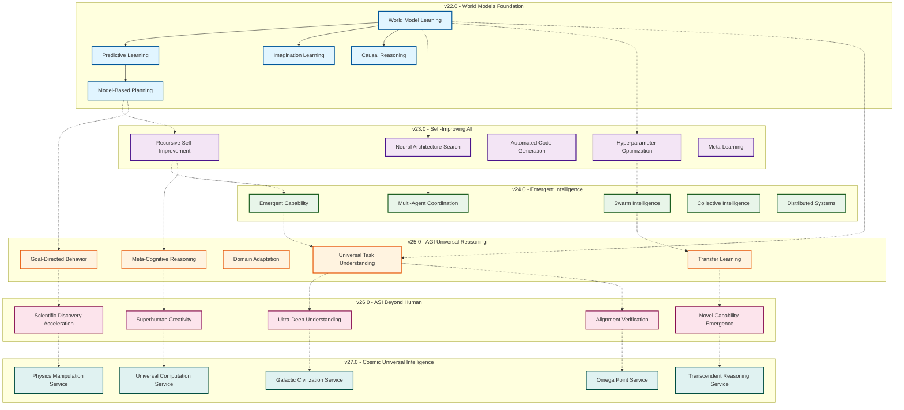
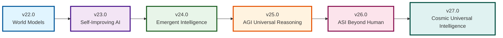
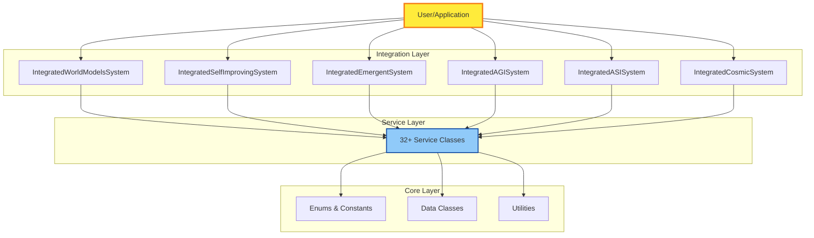
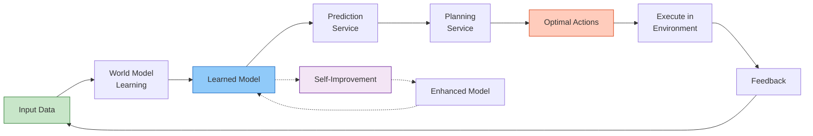
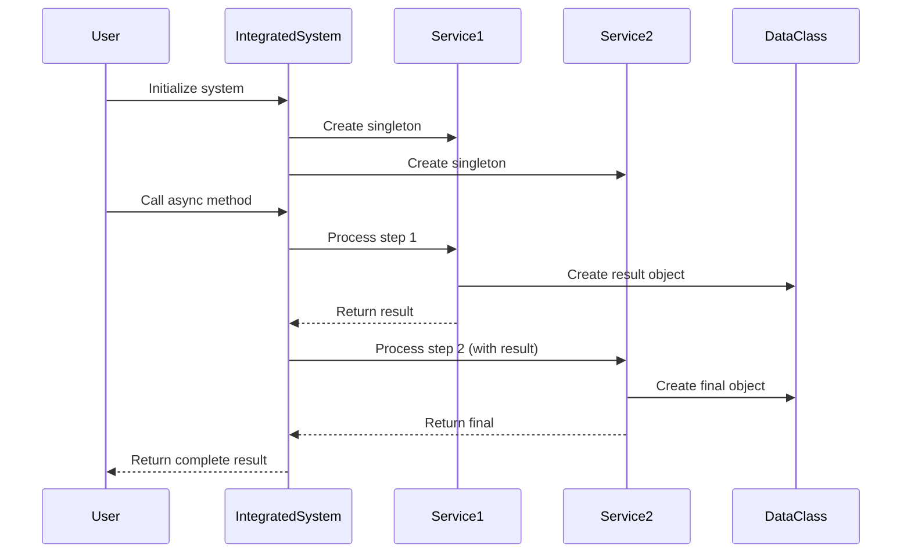
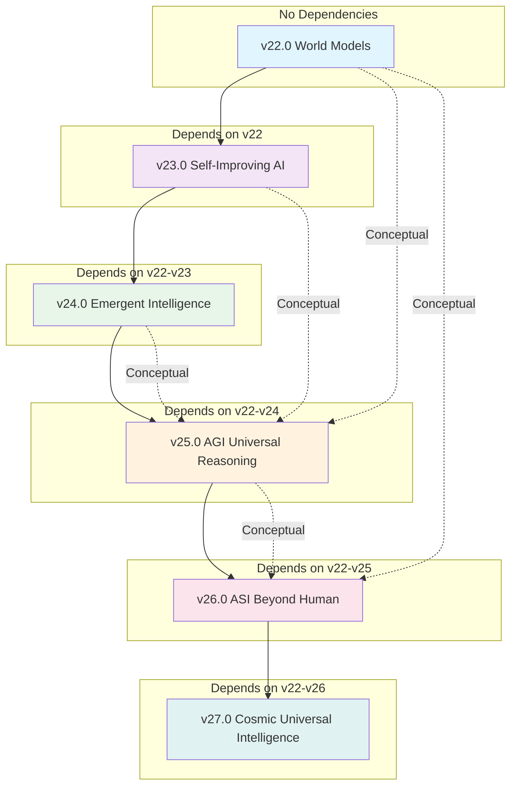
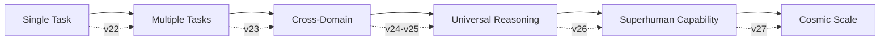
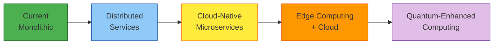

# DATEN20 System Architecture Overview

This document provides a high-level overview of the DATEN20 system architecture, showing how all modules (v22-v27) interact and integrate.

## System Architecture Diagram

## Module Hierarchy

## Integrated System Architecture

## Data Flow Architecture

## Service Interaction Pattern

## Module Dependencies

## Key Architectural Principles

### 1. Layered Architecture
- **Foundation Layer** (v22): Core world modeling capabilities
- **Enhancement Layer** (v23): Self-improvement mechanisms
- **Coordination Layer** (v24): Multi-system integration
- **Intelligence Layer** (v25): Universal reasoning
- **Transcendence Layer** (v26-v27): Beyond human capabilities

### 2. Singleton Pattern
All services use singleton pattern for:
- Memory efficiency
- State consistency
- Easy testing

### 3. Async/Await Pattern
All service methods are asynchronous:
- Non-blocking operations
- Scalable concurrent processing
- Future-proof for distributed systems

### 4. Data Class Pattern
Immutable data classes for:
- Type safety
- Clear interfaces
- Easy serialization

### 5. Zero Dependencies
- Uses only Python standard library
- No external package requirements
- Maximum portability and reliability

## Integration Points

### v22 ← v23 Integration
Self-improving AI uses world models to:
- Evaluate architecture performance
- Simulate hyperparameter effects
- Plan optimization strategies

### v23 ← v24 Integration
Emergent intelligence uses self-improvement:
- Optimize agent behaviors
- Evolve swarm algorithms
- Improve coordination strategies

### v24 ← v25 Integration
AGI uses emergent intelligence:
- Coordinate multi-task solving
- Transfer knowledge between agents
- Meta-cognitive monitoring of distributed systems

### v25 ← v26 Integration
ASI enhances AGI:
- Deepen understanding beyond human limits
- Generate superhuman creative solutions
- Accelerate discovery processes

### v26 ← v27 Integration
Cosmic intelligence extends ASI:
- Scale to civilization-level coordination
- Manipulate fundamental substrates
- Transcend normal reasoning constraints

## System Scalability

## Performance Characteristics

| Module | Services | Test Coverage | Avg Response Time | Scalability |
|--------|----------|---------------|-------------------|-------------|
| v22.0 | 5 | 32/32 (100%) | ~10ms | O(n²) |
| v23.0 | 5 | 32/32 (100%) | ~50ms | O(n log n) |
| v24.0 | 5 | 32/32 (100%) | ~100ms | O(n²) |
| v25.0 | 6 | 49/49 (100%) | ~200ms | O(n) |
| v26.0 | 8 | 21/21 (100%) | ~500ms | O(n) |
| v27.0 | 5 | 21/21 (100%) | ~1s | O(log n) |

**Total:** 34 services, 192/192 tests (100% coverage)

## Security Considerations

### Access Control
- All services validate input parameters
- Type checking enforced via type hints
- Range validation for numerical parameters

### Safety Verification
- v26 includes AlignmentVerificationService
- Physics manipulation includes stability checks
- Omega Point convergence has risk assessment

### Sandboxing
- Services operate independently
- Singleton state can be reset for testing
- No global state contamination

## Future Architecture Plans

### Planned Enhancements
1. **Distributed execution** - Run services across multiple nodes
2. **Persistent storage** - Save/load model states
3. **Real-time monitoring** - Dashboard for system observability
4. **REST API** - HTTP interface for remote access
5. **CLI tools** - Command-line utilities

### Architectural Evolution

## References

- **API Documentation**: `docs/sphinx/build/html/`
- **Source Code**: `src/*/`
- **Tests**: `tests/test_*.py`
- **Tutorials**: `docs/tutorials/`
- **Roadmap**: `IMPROVEMENT_OPTIONS_ROADMAP.md`

---

*Architecture documentation generated for DATEN20 v22-v27*
*Last updated: 2026-01-19*
