# v22.0 World Models Architecture

Detailed architecture documentation for the World Models module.

## Module Overview

World Models enable AI systems to learn predictive models of their environment, plan using imagination, and reason about cause-and-effect relationships.

## Service Architecture

```mermaid
graph TB
    subgraph "World Models Services (v22.0)"
        WML[WorldModelLearning<br/>Learn from experiences]
        PL[PredictiveLearning<br/>Forecast future states]
        MBP[ModelBasedPlanning<br/>Plan optimal actions]
        IL[ImaginationLearning<br/>Learn through simulation]
        CR[CausalReasoning<br/>Understand cause-effect]
    end

    subgraph "Data Classes"
        State[State<br/>Environment state]
        Trans[Transition<br/>State-action-state]
        WM[WorldModel<br/>Learned model]
        Pred[Prediction<br/>Future forecasts]
        Plan[Plan<br/>Action sequence]
        IR[ImaginationRollout<br/>Simulated trajectory]
        CI[CausalIntervention<br/>Causal manipulation]
    end

    subgraph "Enums"
        MT[ModelType<br/>DETERMINISTIC/STOCHASTIC]
        PT[PredictionType<br/>SINGLE_STEP/MULTI_STEP]
        PA[PlanningAlgorithm<br/>RANDOM_SHOOTING/CEM]
        RL[RolloutLength<br/>SHORT/MEDIUM/LONG]
    end

    WML --> State
    WML --> Trans
    WML --> WM
    WML --> MT

    PL --> WM
    PL --> Pred
    PL --> PT

    MBP --> WM
    MBP --> Plan
    MBP --> PA

    IL --> IR
    IL --> RL

    CR --> CI
    CR --> State

    style WML fill:#e1f5ff,stroke:#01579b,stroke-width:2px
    style PL fill:#e1f5ff,stroke:#01579b,stroke-width:2px
    style MBP fill:#e1f5ff,stroke:#01579b,stroke-width:2px
    style IL fill:#e1f5ff,stroke:#01579b,stroke-width:2px
    style CR fill:#e1f5ff,stroke:#01579b,stroke-width:2px
```

## Class Diagram

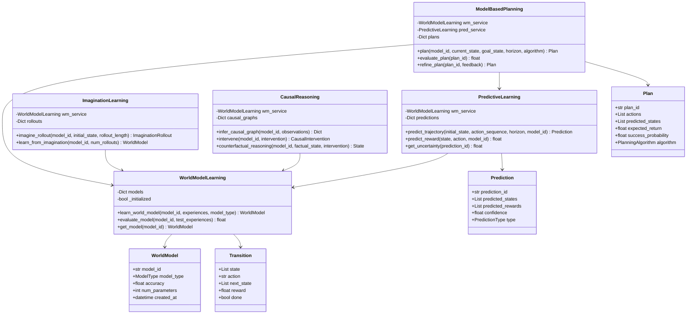

## Learning Workflow

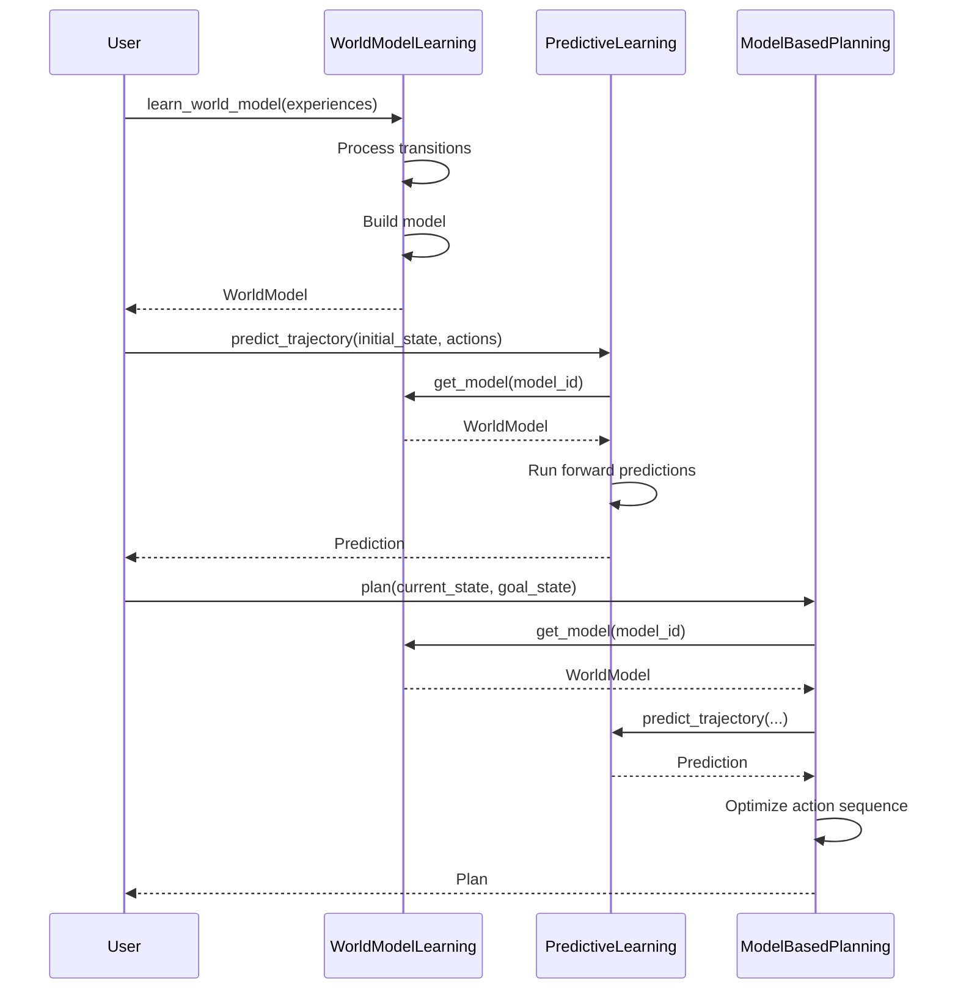

## Data Flow

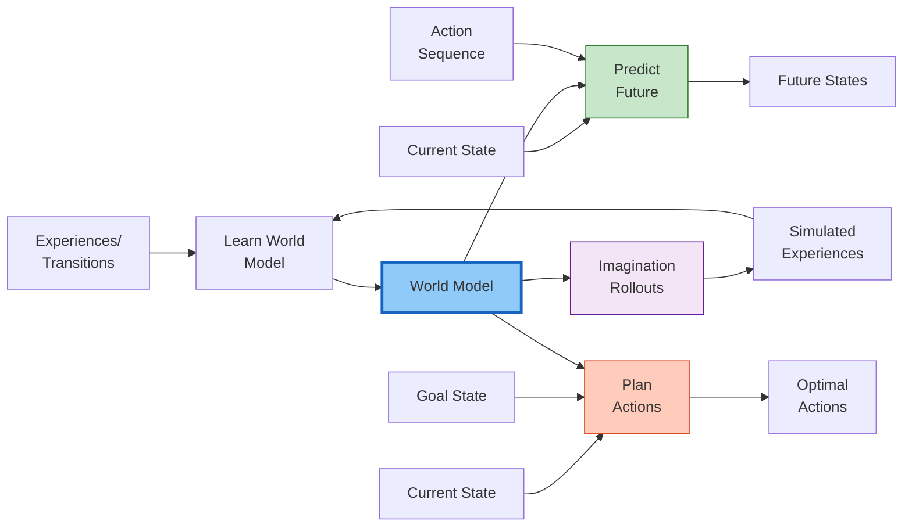

## Planning Algorithms

### Random Shooting

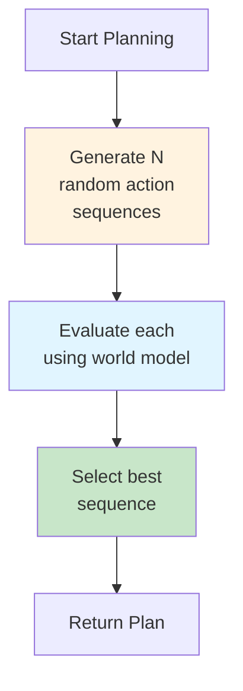

### Cross-Entropy Method (CEM)

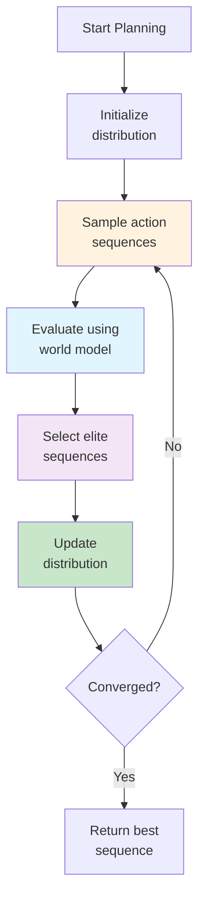

## Imagination Learning Process

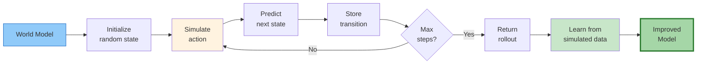

## Causal Reasoning Flow

```mermaid
flowchart TB
    Obs[Observations] --> Infer[Infer Causal<br/>Graph]
    Infer --> Graph[Causal Graph]

    Graph --> Intervene[Apply<br/>Intervention]
    Inter[Intervention<br/>do(X=x)] --> Intervene
    Intervene --> Predict[Predict<br/>Outcomes]
    Predict --> Result[Intervention<br/>Result]

    Graph --> CF[Counterfactual<br/>Reasoning]
    Factual[Factual State] --> CF
    CFInter[CF Intervention] --> CF
    CF --> CFResult[Counterfactual<br/>State]

    style Graph fill:#90caf9,stroke:#1565c0
    style Intervene fill:#fff3e0
    style CF fill:#f3e5f5
```

## State Representation

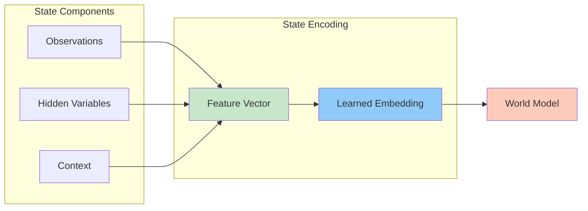

## Model Types Comparison

| Feature | Deterministic | Stochastic |
|---------|--------------|------------|
| **Prediction** | Single next state | Distribution over states |
| **Uncertainty** | No | Yes |
| **Complexity** | Low | Medium-High |
| **Use Case** | Simple, predictable envs | Complex, noisy envs |
| **Planning** | Faster | More robust |

## Integration with Other Modules

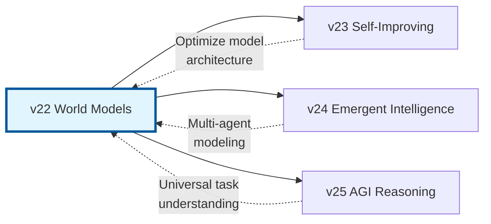

## Performance Characteristics

### Time Complexity
- **Learning**: O(n × m) where n=experiences, m=model_size
- **Prediction**: O(h × s) where h=horizon, s=state_size
- **Planning**: O(k × h × s) where k=num_simulations

### Space Complexity
- **Model Storage**: O(m) where m=num_parameters
- **Prediction Cache**: O(p × h × s) where p=num_predictions

### Scalability
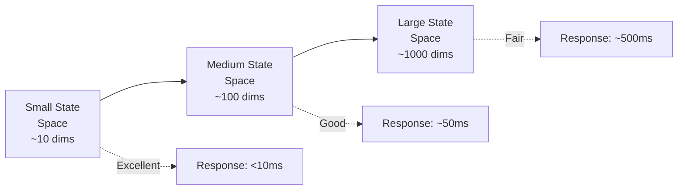

## Testing Coverage

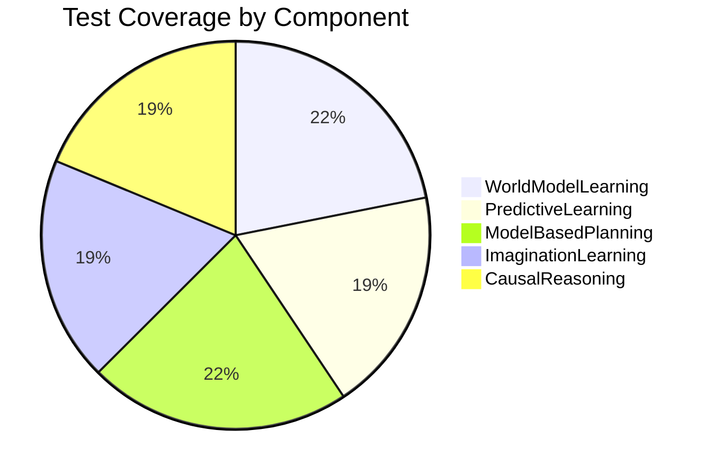

**Total:** 32/32 tests passing (100%)

## Key Design Patterns

### 1. Singleton Pattern
```python
class WorldModelLearning:
    _instance = None

    def __new__(cls):
        if cls._instance is None:
            cls._instance = super().__new__(cls)
            cls._initialized = False
        return cls._instance
```

### 2. Async Pattern
```python
async def learn_world_model(
    self, model_id: str, experiences: List[Transition], model_type: ModelType
) -> WorldModel:
    # Async learning logic
    await asyncio.sleep(0)  # Yield control
    return world_model
```

### 3. Data Class Pattern
```python
@dataclass
class WorldModel:
    model_id: str
    model_type: ModelType
    accuracy: float
    num_parameters: int
    created_at: datetime
```

## Common Usage Patterns

### Pattern 1: Basic Learning
```python
wm_service = WorldModelLearning()
model = await wm_service.learn_world_model(
    model_id="my_model",
    experiences=transitions,
    model_type=ModelType.DETERMINISTIC
)
```

### Pattern 2: Planning Loop
```python
wm_service = WorldModelLearning()
pred_service = PredictiveLearning(wm_service)
planning = ModelBasedPlanning(wm_service, pred_service)

plan = await planning.plan(
    model_id="my_model",
    current_state=current,
    goal_state=goal,
    horizon=10
)
```

### Pattern 3: Imagination-Based Learning
```python
imagination = ImaginationLearning(wm_service)
rollout = await imagination.imagine_rollout(
    model_id="my_model",
    initial_state=state,
    rollout_length=RolloutLength.MEDIUM
)

improved_model = await imagination.learn_from_imagination(
    model_id="my_model",
    num_rollouts=100
)
```

## API Reference

See full API documentation: `docs/sphinx/build/html/modules/world_models.html`

## Source Code

- **Implementation**: `src/world_models/world_models_services.py`
- **Tests**: `tests/test_world_models.py`
- **Tutorial**: `docs/tutorials/beginner/01_world_models_basics.md`

---

*v22.0 World Models Architecture*
*Part of DATEN20 Advanced AI Services*
