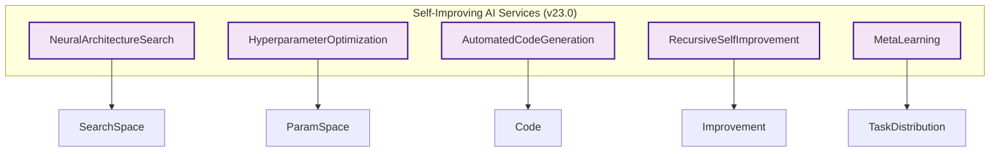
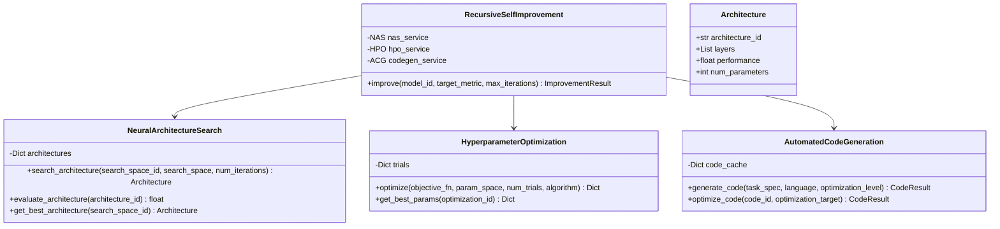
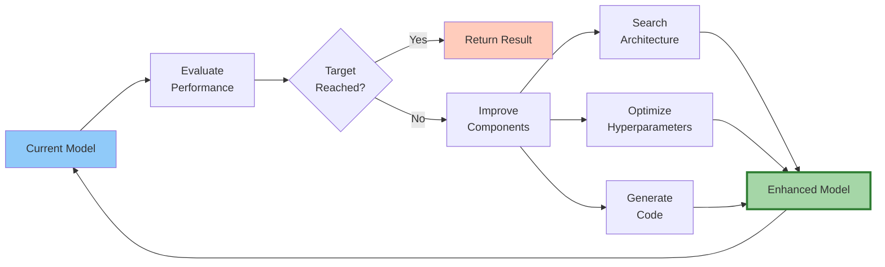
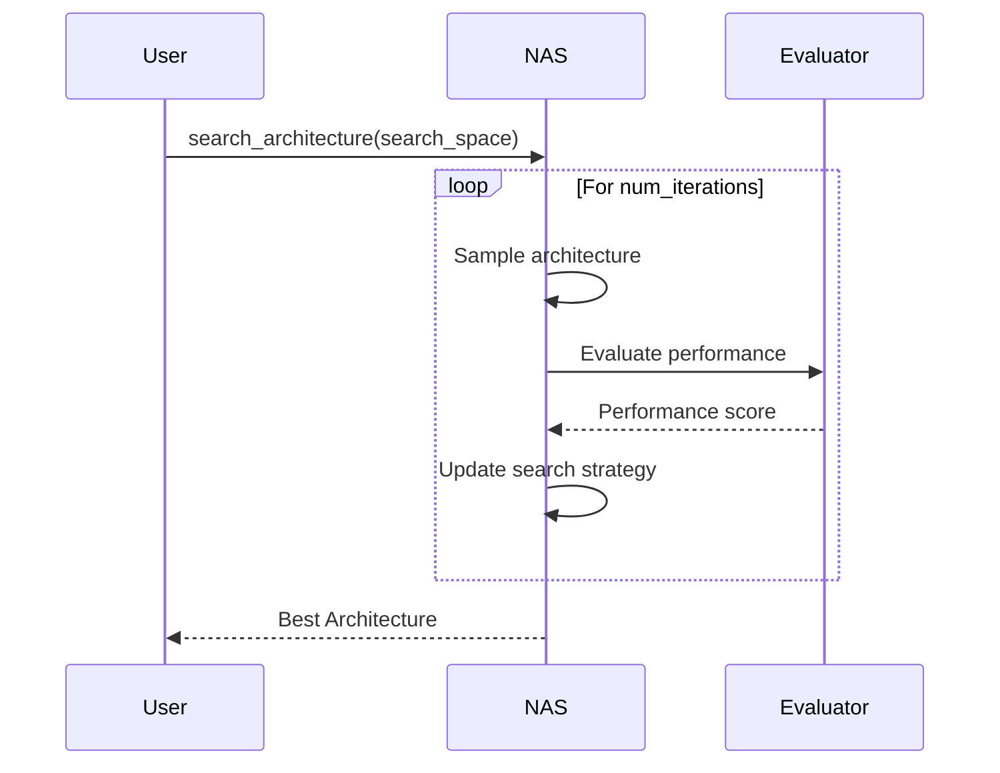
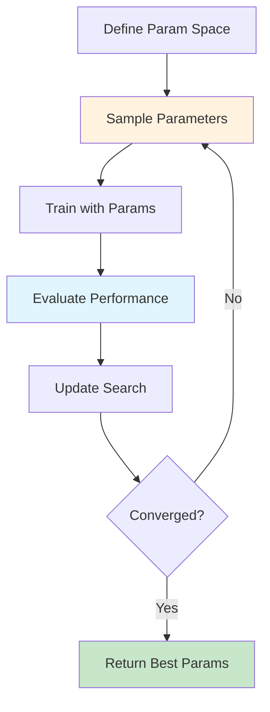
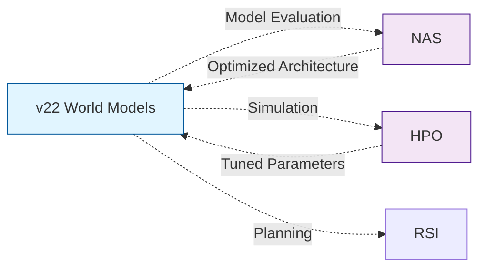

# v23.0 Self-Improving AI Architecture

Architecture documentation for the Self-Improving AI module.

## Service Architecture

## Class Diagram

## Recursive Improvement Loop

## NAS Process

## HPO Workflow

## Integration with World Models

## Performance Characteristics

| Operation | Time Complexity | Space Complexity |
|-----------|----------------|------------------|
| NAS | O(n × k) | O(n) |
| HPO | O(n × m) | O(n) |
| Code Gen | O(k) | O(k) |
| RSI | O(i × (n+m+k)) | O(n+m+k) |

Where: n=architectures, k=code size, m=trials, i=iterations

## Testing Coverage

32/32 tests passing (100%)

## Source Code

- **Implementation**: `src/self_improving/self_improving_services.py`
- **Tests**: `tests/test_self_improving.py`
- **Tutorial**: `docs/tutorials/beginner/02_self_improving_basics.md`

---

*v23.0 Self-Improving AI Architecture*
