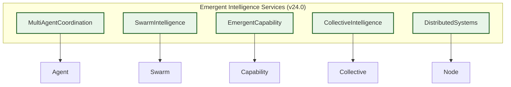
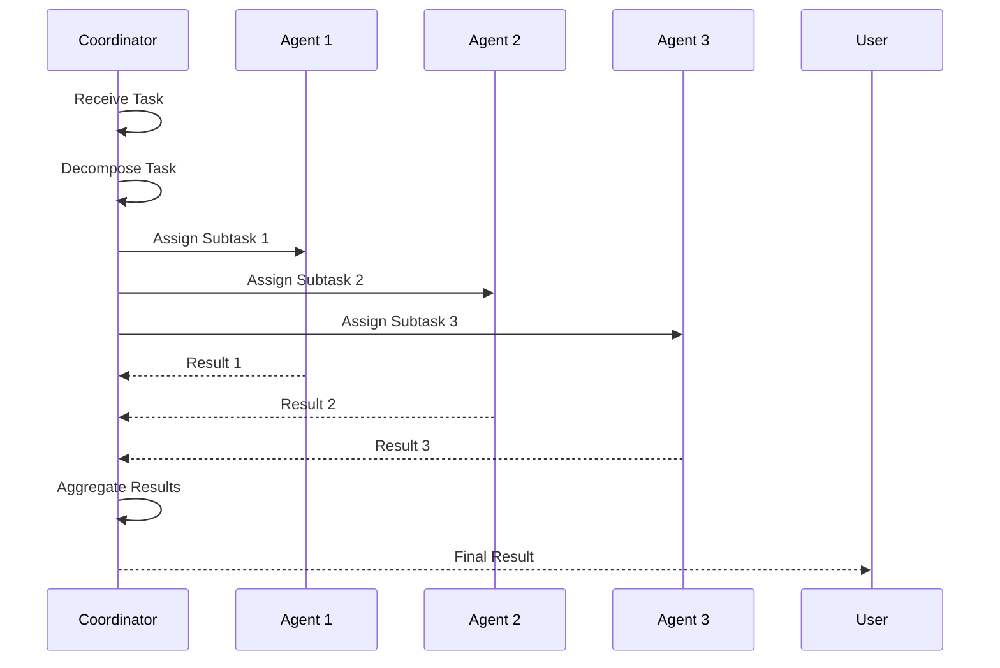
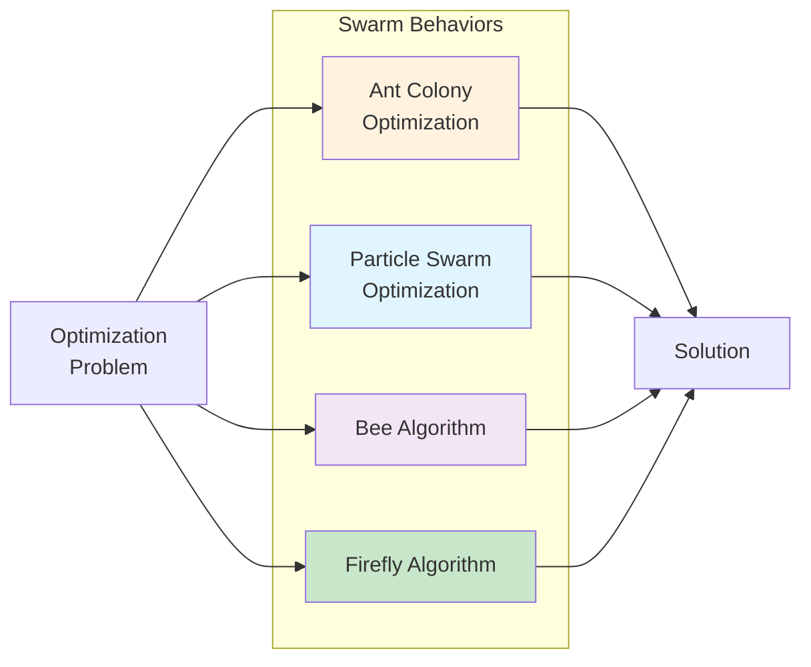
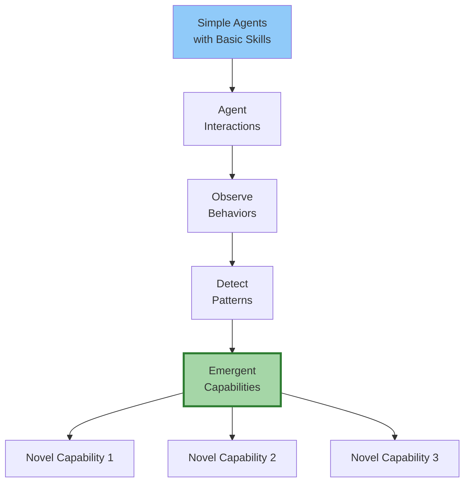
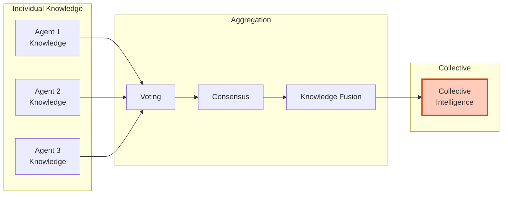
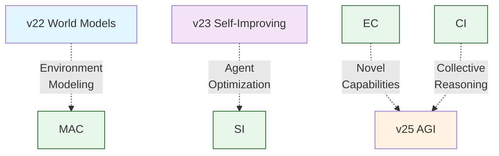
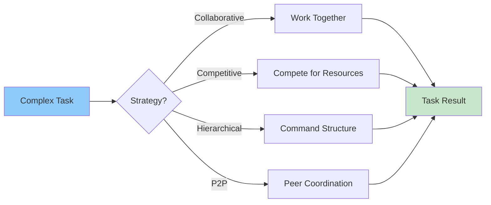

# v24.0 Emergent Intelligence Architecture

Architecture documentation for the Emergent Intelligence module.

## Service Architecture

## Multi-Agent Coordination

## Swarm Intelligence Patterns

## Emergent Capability Discovery

## Collective Intelligence Process

## Integration Points

## Coordination Strategies

## Performance Characteristics

| Component | Agents | Time Complexity | Scalability |
|-----------|--------|-----------------|-------------|
| MAC | 1-100 | O(n²) | Good |
| SI | 10-1000 | O(n log n) | Excellent |
| EC | 5-50 | O(n²) | Fair |
| CI | 3-30 | O(n) | Good |

## Testing Coverage

32/32 tests passing (100%)

## Source Code

- **Implementation**: `src/emergent_intelligence/emergent_services.py`
- **Tests**: `tests/test_emergent_intelligence.py`
- **Tutorial**: `docs/tutorials/beginner/03_emergent_intelligence_basics.md`

---

*v24.0 Emergent Intelligence Architecture*
