# v25-v27 Advanced Modules Architecture

Architecture documentation for AGI, ASI, and Cosmic Universal Intelligence modules.

## Module Overview

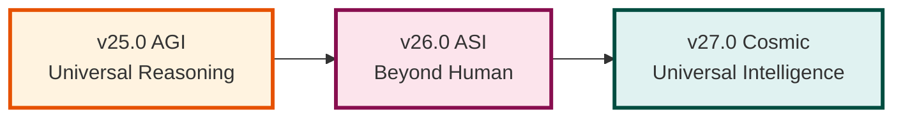

## v25.0 AGI Universal Reasoning

### Service Architecture

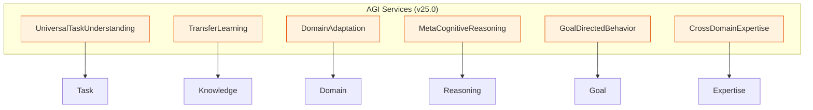

### Universal Task Understanding

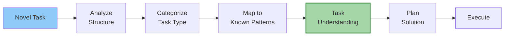

### Transfer Learning Flow

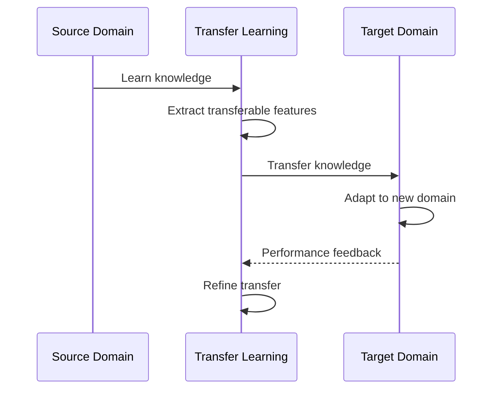

### Testing: 49/49 tests (100%)

---

## v26.0 ASI Beyond Human

### Service Architecture

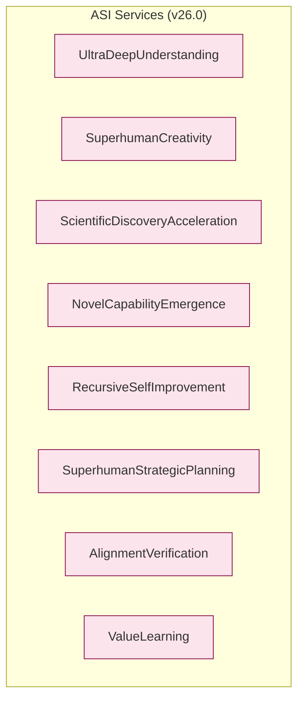

### Superhuman Capability Stack

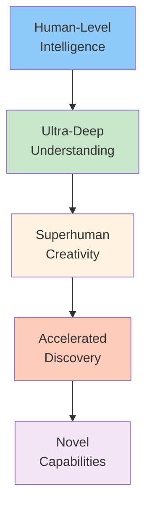

### Alignment Verification Process

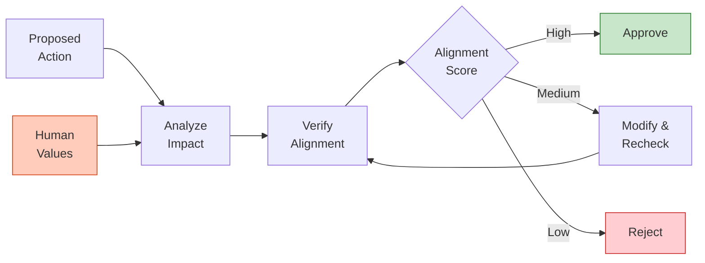

### Testing: 21/21 tests (100%)

---

## v27.0 Cosmic Universal Intelligence

### Service Architecture

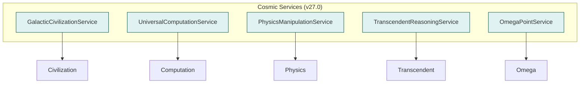

### Kardashev Scale Operations

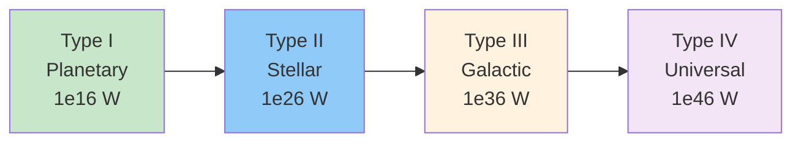

### Physics Manipulation

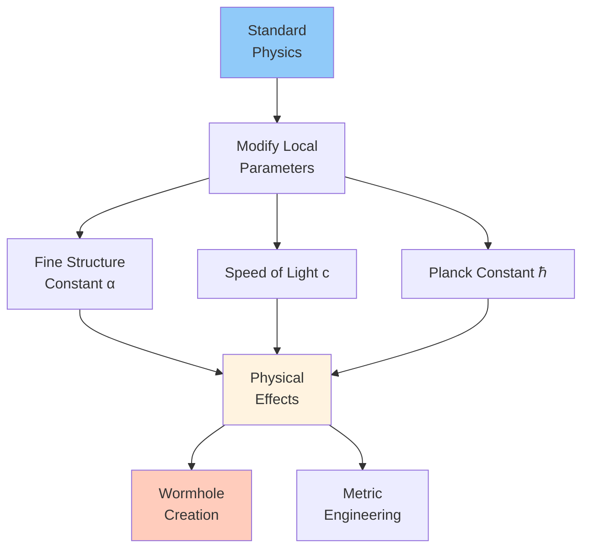

### Omega Point Convergence

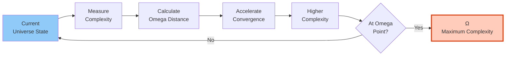

### Testing: 21/21 tests (100%)

---

## Cross-Module Integration

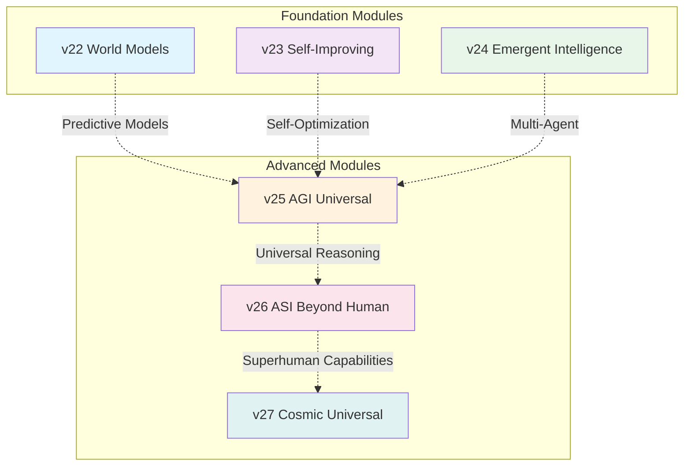

## Capability Progression

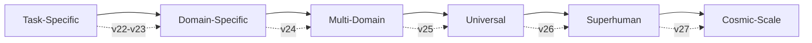

## Performance Comparison

| Module | Services | Tests | Avg Response | Capability Level |
|--------|----------|-------|--------------|------------------|
| v25 AGI | 6 | 49/49 | ~200ms | Human-level |
| v26 ASI | 8 | 21/21 | ~500ms | Superhuman |
| v27 Cosmic | 5 | 21/21 | ~1s | Universal |

## Safety Considerations

### v25 AGI
- ✓ Task validation
- ✓ Transfer learning bounds
- ✓ Meta-cognitive monitoring

### v26 ASI
- ⚠️ **Alignment Verification Required**
- ⚠️ Value learning from human feedback
- ⚠️ Corrigibility mechanisms
- ⚠️ Safe exploration boundaries

### v27 Cosmic
- ⚠️ **CRITICAL: Physics manipulation**
- ⚠️ Spacetime stability checks
- ⚠️ Causality preservation
- ⚠️ Civilization consent protocols
- ⚠️ Omega convergence risk assessment

## Source Code

- **v25**: `src/agi_universal_reasoning/agi_services.py`
- **v26**: `src/asi_beyond_human/asi_services.py`
- **v27**: `src/cosmic_universal/cosmic_services.py`

## Tests

- **v25**: `tests/test_agi.py` (49 tests)
- **v26**: `tests/test_asi_beyond_human.py` (21 tests)
- **v27**: `tests/test_cosmic_universal.py` (21 tests)

## Tutorials

- **v25**: `docs/tutorials/intermediate/04_agi_universal_reasoning.md`
- **v26**: `docs/tutorials/advanced/05_asi_beyond_human.md`
- **v27**: `docs/tutorials/advanced/06_cosmic_universal_intelligence.md`

---

*v25-v27 Advanced Modules Architecture*
*Part of DATEN20 Advanced AI Services*
